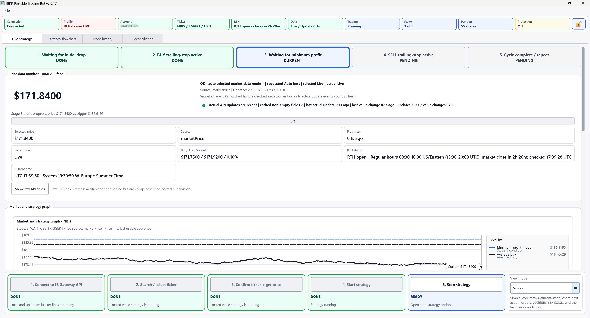
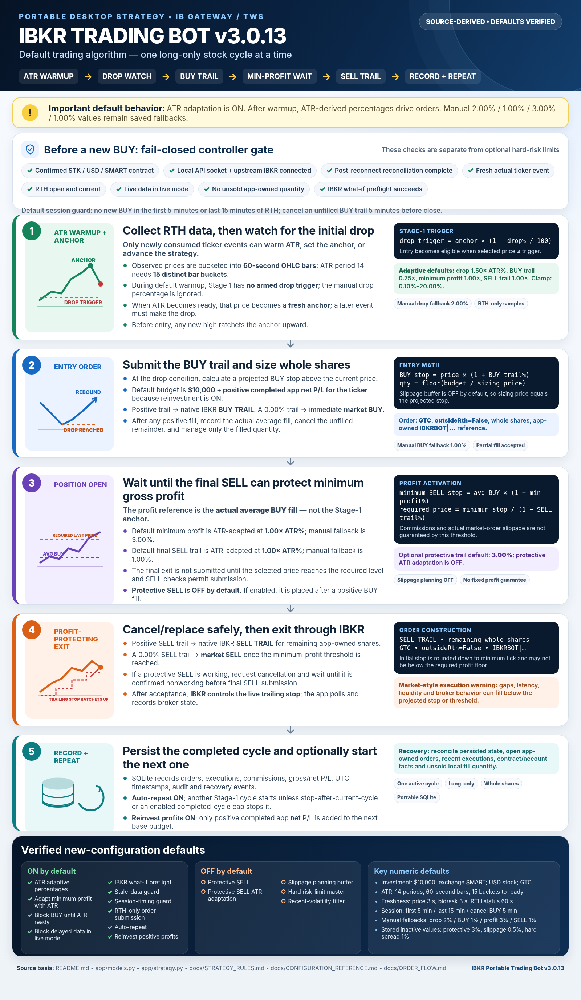
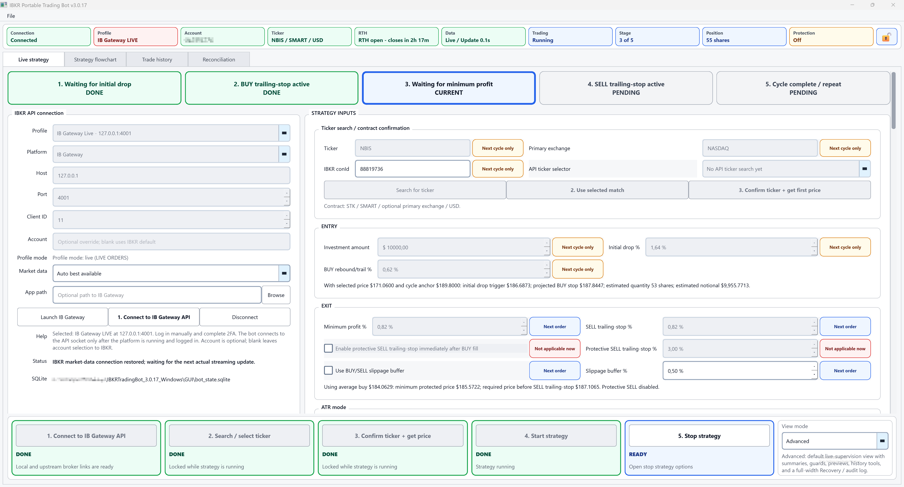
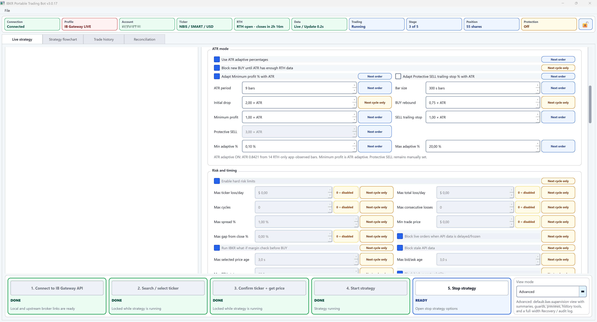
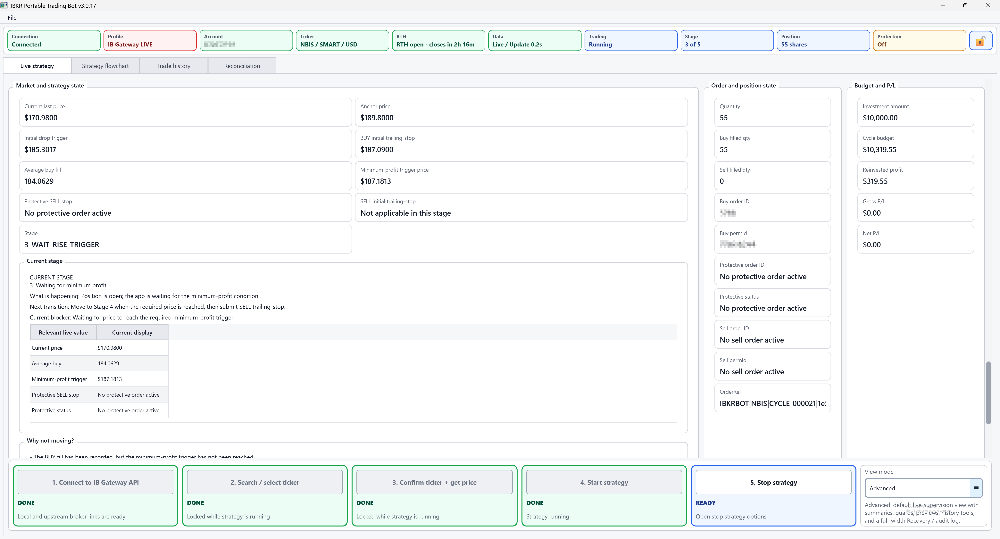
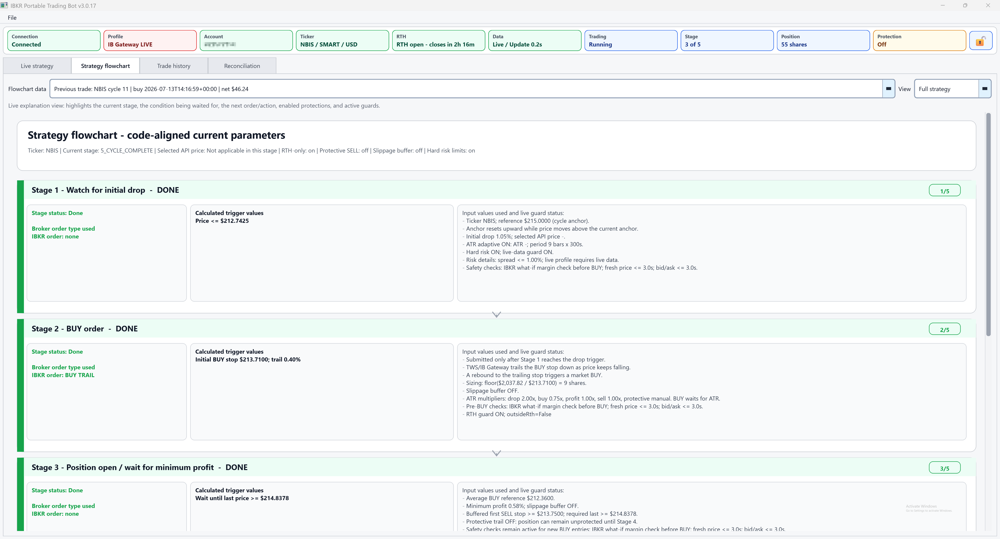
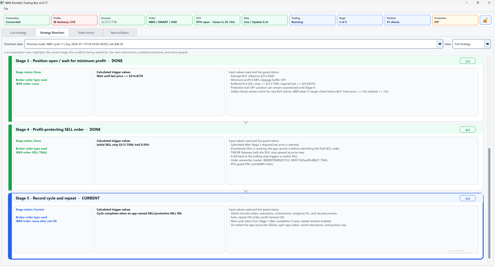
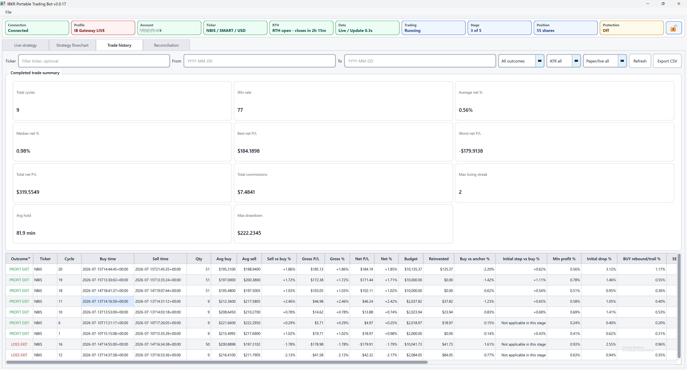
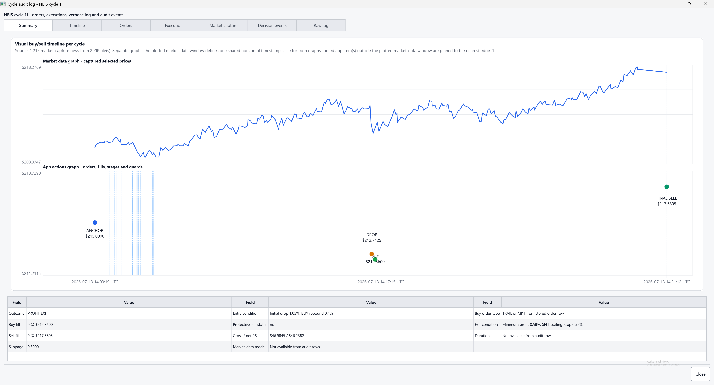

# IBKR Portable Trading Bot v3.0.18



A Windows desktop application that automates one long-only Interactive Brokers stock-trading cycle at a time through Trader Workstation (TWS) or IB Gateway.

The application watches a confirmed stock contract, waits for a configurable decline, enters on a rebound, and delays its normal profit-taking exit until the configured minimum-profit condition can be protected. An optional protective SELL may be submitted earlier after a BUY fill. The application uses IBKR-native trailing-stop or market orders, persists its state in a local SQLite database, and provides recovery, audit, and diagnostic tools for application-owned orders and fills.

> [!CAUTION]
> This software can transmit live orders. Native trailing stops trigger market-style execution and do not guarantee a stop price, fill price, or profit. Gaps, latency, insufficient liquidity, rejected orders, commissions, and broker behavior can produce results that differ from the application projections. Review the settings, broker permissions, market-data subscription, and recovery state before enabling live trading.

> [!NOTE]
> This repository is source-available under the [PolyForm Noncommercial License 1.0.0](LICENSE). Noncommercial use, modification, and redistribution are permitted under its terms; commercial use requires separate permission from the licensor.

## Contents

- [What the bot does](#what-the-bot-does)
- [Trading cycle](#trading-cycle)
- [Core features](#core-features)
- [Screenshots](#screenshots)
- [Advanced features](#advanced-features)
- [What the bot does not do](#what-the-bot-does-not-do)
- [Requirements and dependencies](#requirements-and-dependencies)
- [Installation](#installation)
- [IBKR setup](#ibkr-setup)
- [Using the application](#using-the-application)
- [Data, backups, and diagnostics](#data-backups-and-diagnostics)
- [Repository safety](#repository-safety)
- [Testing and Windows builds](#testing-and-windows-builds)
- [Project structure](#project-structure)
- [Documentation](#documentation)
- [Release history](#release-history)
- [Thank me](#thank-me)
- [License](#license)

## What the bot does

The bot implements a five-stage strategy for one confirmed IBKR stock contract:

1. Watch for an initial percentage drop from a rising anchor.
2. Enter with a native BUY trailing stop, or a market BUY when the BUY trail is configured as zero.
3. Wait until a SELL order can protect the configured minimum gross profit relative to the actual average BUY fill.
4. Exit with a native SELL trailing stop, or a market SELL when the SELL trail is configured as zero.
5. Record the completed cycle and optionally start another cycle.

The strategy is long-only. It buys whole shares and then sells only the quantity attributed to the application’s recorded fills. Orders created by the application use an `OrderRef` beginning with `IBKRBOT|` so recovery and cancellation logic can distinguish them from unrelated orders.

The application is portable: its SQLite database, logs, exports, backups, audit reports, and completed market-data captures are stored beside the source tree or packaged executable.

## Trading cycle

### Stage 1 — wait for the initial drop

The first usable strategy price becomes the anchor. Before the drop occurs, a new higher price raises the anchor. The manual drop level is:

```text
drop trigger = anchor × (1 - initial drop % / 100)
```

When ATR-adaptive mode and **Block new BUY until ATR has enough RTH data** are both enabled, the manual initial-drop percentage is not used during ATR warmup. Stage 1 has no armed drop trigger until enough regular-trading-hours samples exist. The first ready ATR update establishes a fresh anchor; only a later price update can satisfy the ATR-derived drop.

### Stage 2 — enter on a rebound

After the drop condition is met, the projected BUY stop is:

```text
projected BUY stop = current price × (1 + BUY rebound/trail % / 100)
quantity = floor(budget / sizing price)
```

The sizing price is the projected BUY stop, optionally increased by the configured planning-only slippage buffer. A positive BUY trail creates a native IBKR `TRAIL` order. A zero BUY trail creates a market BUY immediately after the drop condition.

When any positive BUY quantity fills, the application attempts to cancel the unfilled remainder and continues with the filled quantity.

### Stage 3 — wait for minimum profit

The actual average BUY fill is the profit reference. Without the optional slippage assumption:

```text
minimum initial SELL stop = average BUY fill × (1 + minimum profit % / 100)
required last price = minimum initial SELL stop / (1 - SELL trail % / 100)
```

The final SELL is not submitted until the selected strategy price reaches the required level. This is a gross planning threshold before commissions and actual market-order slippage; it is not a profit guarantee.

### Stage 4 — manage the exit

A positive SELL trail creates a native SELL `TRAIL` order. A zero SELL trail creates a market SELL after the minimum-profit condition is reached. The broker controls the native trail after order submission.

An optional protective SELL trail can be submitted immediately after a BUY fill. When the normal minimum-profit exit becomes eligible, the application first requests cancellation of the protective order and waits for confirmation before submitting the final SELL. This prevents two application-created SELL orders from intentionally working for the same shares at once.

### Stage 5 — complete or repeat

The application records fills, commissions received from IBKR, gross and net P/L, timing, order references, and audit events. With auto-repeat enabled, another cycle starts unless **Stop after current cycle** is active or the enabled hard-risk maximum completed-cycle cap has been reached.

</p>
<p float="center">
  
</p>

## Core features

- PySide6 desktop GUI with connection, strategy, flowchart, history, and reconciliation views.
- TWS and IB Gateway connection profiles for live and paper endpoints.
- Contract search and qualification through the IBKR API.
- Whole-share budget sizing.
- Native IBKR BUY and SELL trailing-stop orders.
- Market-order alternatives when a trail percentage is exactly zero.
- Optional automatic cycle repetition and reinvestment of positive completed application P/L.
- Portable SQLite persistence and additive schema migration.
- Atomic resume checkpoints for normal exits and controlled Windows update/sign-out/shutdown requests.
- Single-instance lock to reduce the risk of two copies using the same database and API client configuration.
- UTC audit timestamps throughout the application.
- CSV trade-history export and diagnostic audit bundles.

## Screenshots

<p float="left">
  
  
  
</p>
<p float="left">
  
  
  
</p>
<p float="center">
  
  
</p>

## Advanced features

### ATR-adaptive percentages

ATR mode derives selected strategy percentages from application-observed, RTH-only API prices grouped into fixed-duration OHLC bars. These are not broker-provided historical bars. The defaults are:

| Setting | Default |
|---|---:|
| ATR period | 14 true-range periods (15 observed bar buckets required; the newest may still be forming) |
| Bar duration | 60 seconds |
| Initial drop multiplier | 1.50 × ATR% |
| BUY rebound multiplier | 0.75 × ATR% |
| Minimum-profit multiplier | 1.00 × ATR% |
| SELL trail multiplier | 1.00 × ATR% |
| Optional protective SELL multiplier | 3.00 × ATR% |
| Percentage clamp | 0.10% to 20.00% |

ATR adaptation is enabled by default. Minimum profit is adapted by default; protective SELL adaptation is optional and off by default. New entries are blocked during ATR warmup by default.

RTH observations and diagnostic ATR bars are collected even while adaptation is disabled. In that state the GUI can show warmup/readiness, but no strategy percentage is changed. Collection pauses outside RTH. The observation buffer is held in memory for the current application session and is reset when the process restarts; it is not a broker historical-bar cache.

### Gateway connectivity and quote freshness

The application tracks two independent connection facts:

- the local API socket between the application and TWS/IB Gateway;
- the upstream connection between TWS/IB Gateway and IBKR servers.

A running Gateway can retain the local socket while its Internet/server connection is unavailable. IBKR connectivity messages are therefore handled separately from `isConnected()`:

- **1100/2110:** immediately invalidate market-data freshness and pause strategy advancement, broker-order polling, and new order submission;
- **1101:** reconcile app-owned orders/executions and create new market-data subscriptions because the old requests were lost;
- **1102:** reconcile app-owned orders/executions, retain the existing subscription handle, but still require a post-recovery ticker event before prices become strategy-usable again;
- **10197:** treat a competing IBKR market-data session as a quote-delivery outage, invalidate cached values, and wait for a new streaming event without assuming that the order/API channel is disconnected;
- **2103/2104:** invalidate quote freshness when a market-data farm disconnects or reports restored, then require the next actual ticker event before showing the feed as live again;
- **1300:** treat the API socket-port reset as unavailable and require a normal local reconnect.

Freshness is based on actual `ib_async` `pendingTickersEvent` deliveries. Re-reading a `Ticker` object whose bid, ask, or last fields are still populated does not refresh the quote age, advance Stage 1 or Stage 3, or add an ATR/volatility observation. Quote age is also re-evaluated on every GUI snapshot, so a formerly green indicator changes to stale even when the worker temporarily performs no new quote read. The fields may remain visible for diagnosis, but they are marked cached-only, invalidated, or stale and are not tradeable. The callback arrival time, rather than the later GUI/controller read time, is used for quote age and ATR bucketing. If the supported adapter cannot register the ticker-update event at all, market data fails closed instead of reverting to cached-field freshness.

After upstream restoration, normal processing remains paused until the application has reconciled app-owned open orders and recent executions. Native orders already accepted by IBKR are not automatically cancelled solely because connectivity is lost; their status and fills are imported during recovery when broker facts become available.

### Entry and market-data guards

The controller evaluates configured blockers before a BUY is transmitted. The top-right **Trading** status shows a compact blocker summary; its tooltip lists all currently evaluated blockers. Depending on configuration and runtime state, blockers include:

The regular-session open/close window comes from the qualified IBKR contract's date-specific `liquidHours` when available. The same parsed boundaries drive the first-minutes, last-minutes, and cancel-before-close controls, so early closes are respected. The adapter's existing weekday 09:30–16:00 New York fallback is used only when IBKR supplies no usable contract hours.

- a disconnected local API socket, lost Gateway-to-IBKR server link, or incomplete post-reconnect reconciliation;
- no actual post-connect/post-recovery ticker event, or missing, invalid, cached-only, or stale selected price;
- stale or missing bid/ask data;
- unknown, stale, or closed RTH status;
- delayed or non-live data in live trading;
- ATR warmup;
- first/last minutes of the regular session;
- excessive spread relative to the fixed user-configured **Maximum spread %**, or an excessive previous-close gap;
- minimum trade price;
- recent observed volatility;
- configured daily-loss, cycle-count, or loss-streak limits;
- an unresolved application-owned long quantity;
- what-if, preflight, order-submission, or protective-order cancellation failures.

Expected guard/session pauses are displayed as caution states. **Red is reserved for real broker/local-state inconsistencies** and states requiring operator reconciliation. The Maximum spread field is never rewritten from live bid/ask data; only explicit user edits and loading the saved setting can change it.

### Optional account routing

The Account field is optional. When it is blank, the application leaves `Order.account` unset and lets TWS or IB Gateway apply the connected session’s account selection. Entering an account creates an explicit routing override; in live mode it is validated against the accounts reported by IBKR.

### Application-owned position scope

An existing long position acquired manually or by another program does not, by itself, block a new application BUY. The BUY blocker uses unsold quantity reconstructed from this application’s persisted BUY and SELL fills. A cycle marked **manually handled** is treated as operator-resolved.

IBKR positions are account-level values and individual shares are not tagged by originating application. The application-owned quantity is therefore a local accounting boundary, not broker-side lot segregation. Combining external and application-owned shares in one account can complicate tax lots, manual selling, and reconciliation.

### Recovery and reconciliation

The Reconciliation tab compares local SQLite state with app-owned open orders, the broker position, and recent executions reported by IBKR. It presents a deliberate three-step workflow:

1. **Refresh from IBKR/TWS** to retrieve current broker facts without placing, modifying, or cancelling an order.
2. Compare SQLite with the returned orders, position, and executions.
3. Choose a resolution action only after the comparison is understood.

The screen shows whether the broker probe is **Not refreshed**, **Current**, **Stale**, or **Refresh failed**, including the last successful refresh time when a later attempt fails. A successful probe remains current for at most 60 seconds and only while it matches the active cycle's reconciliation-relevant stage, order, and fill facts. Ordinary price updates do not invalidate it; a disconnect, upstream outage, or reconciliation-relevant local/broker change does.

**Reconcile and resume**, **Cancel visible app-owned orders**, **Sell app-bought unsold position**, and **Leave orders working** remain disabled until the probe is current; the same check is repeated when the button is clicked. **Stop after current cycle** is a local intent action and does not require a current broker probe. **Mark manually handled** remains an explicit manual override, but when the probe is not current its confirmation requires independent TWS verification. Audit export remains available.

A configured BUY guard (including ATR warmup), an ordinary strategy wait, or a safe completed cycle is not treated as an actionable recovery fault. A stored active cycle does not resume automatically on startup. The operator must connect and explicitly start/resume monitoring. A sufficiently stale active cycle is put into recovery-required state. Broker-probe rows are point-in-time facts: a newer terminal poll for the same app order retires an older probe row so a completed cycle is not falsely presented as still working.

### Stop choices

The Stop dialog supports five distinct actions:

- cancel open application orders;
- cancel application SELL orders as needed and market-sell the application-owned quantity;
- leave application orders working;
- stop after the current cycle;
- stop monitoring immediately without broker action.

The market-close path waits for cancellation confirmation of a working application SELL before submitting another SELL.

### Market-data capture and audit tools

A bounded in-memory market-data buffer supports per-fill debug capture. After a BUY or SELL fill, the capture contains up to 15 minutes before and 15 minutes after the event. The ZIP is written only after the post-event window completes; an incomplete capture is intentionally lost if the process closes early.

## What the bot does not do

This project is intentionally limited. It does not:

- trade multiple tickers or independent cycles concurrently;
- open short positions;
- trade options, futures, forex, bonds, crypto, funds, or non-`STK` contracts;
- support non-USD contracts or non-SMART routing through the strategy settings;
- manage arbitrary manual orders or orders from other software;
- treat an account-wide IBKR position as wholly owned by the application;
- provide broker-side lot identification for application-created versus external shares;
- guarantee entry price, stop price, exit price, minimum net profit, or protection against gaps;
- calculate taxes, wash sales, tax-lot selection, borrow availability, corporate-action adjustments, or portfolio exposure across other holdings;
- replace TWS/IB Gateway login, authentication, two-factor approval, trading permissions, market-data subscriptions, or broker risk controls;
- operate when the controlling application is closed except for native orders already accepted and held by IBKR;
- guarantee that a fill, cancellation, or protective-order placement will be observed or acted on while the local API or Gateway-to-IBKR server connection is unavailable;
- provide high-availability failover, redundant Internet connectivity, or a second controller process for the same cycle;
- reconstruct incomplete in-memory market-data captures after shutdown;
- provide exchange-native historical ATR bars or persist ATR observations across restarts; ATR uses RTH prices observed by the current running application;
- serve as investment advice, a hosted service, or a high-availability trading system.

## Requirements and dependencies

### Runtime prerequisites

- Windows 10 or later is the intended desktop and packaging environment.
- Python 3.11 or newer when running from source.
- Interactive Brokers TWS or IB Gateway with API/socket access enabled.
- An IBKR account with appropriate trading permissions.
- Suitable real-time market data for live operation. Delayed/frozen data may be displayed, but configured guards can block live BUY orders.

### Python dependencies

| Package | Constraint | Purpose |
|---|---|---|
| `PySide6` | `>=6.7,<7` | Desktop GUI and Qt signals |
| `ib_async` | `>=2.1.0,<3` | IBKR TWS/Gateway socket API wrapper |
| `tzdata` | `>=2025.2` | Time-zone data, including New York session calculations |
| `PyInstaller` | `>=6.21,<7` | Windows portable executable build |
| `pytest` | `>=8,<9` | Automated tests |
| `coverage` | `>=7.6,<8` | Statement, branch, and per-callable test-coverage gates |
| `ruff` | `>=0.8,<1` | Required lint/import quality gate |
| `pyright[nodejs]` | `>=1.1,<2` | Required type-check quality gate with bundled Node runtime where available |

The complete local development/build set is installed from `requirements.txt`. Runtime package metadata is in `pyproject.toml`.

## Installation

### Option A — Windows launcher

1. Clone or download the repository into a writable folder.
2. Install Python 3.11 or newer. The standard Python launcher (`py`) is supported.
3. Double-click `run_dev.bat` from the project root.

The launcher creates `.venv` if needed, upgrades `pip`, installs `requirements.txt`, clears test-only environment variables, and starts the GUI. Its `ExecutionPolicy Bypass` setting applies only to that PowerShell process; it does not change the machine-wide PowerShell policy.

### Option B — command line

From PowerShell in the project root:

```powershell
py -3.11 -m venv .venv
.\.venv\Scripts\python.exe -m pip install --upgrade pip
.\.venv\Scripts\python.exe -m pip install -r requirements.txt
.\.venv\Scripts\python.exe main.py
```

The project does not require a system-wide package installation.

## IBKR setup

Before connecting:

1. Start TWS or IB Gateway and complete login and two-factor authentication.
2. Enable socket/API clients in the platform settings.
3. Confirm that the socket port matches the selected profile.
4. Confirm that the API client ID is not already used by another connected client.
5. Confirm trading permissions and market-data subscriptions for the intended stock.
6. Keep read-only API mode disabled when order transmission is required.

Default profiles:

| Profile | Host | Port |
|---|---|---:|
| IB Gateway live | `127.0.0.1` | `4001` |
| IB Gateway paper | `127.0.0.1` | `4002` |
| TWS live | `127.0.0.1` | `7496` |
| TWS paper | `127.0.0.1` | `7497` |

Host and port remain editable. The optional Start helper can launch a configured local TWS or Gateway executable, but it does not store credentials or complete authentication.

## Using the application

### 1. Connect

Select the TWS/Gateway profile, host, port, client ID, market-data mode, and optional account override. Click **1. Connect**. A blank account means IBKR default routing. The Connection indicator distinguishes a local socket connection from the Gateway/TWS upstream IBKR link; **Gateway only** means the local process is reachable but trading is paused because upstream connectivity is not confirmed. Contract search, ticker confirmation, and strategy start stay disabled until the upstream link is ready and any post-restoration reconciliation has completed.

### 2. Search for a contract

Enter a stock symbol and use **2. Search/select ticker**. Review the API matches and select the intended contract, especially when a symbol exists on multiple venues.

### 3. Confirm the ticker and price

Use **3. Confirm ticker + get price**. The application qualifies the contract and starts/refreshes market-data diagnostics. Review the selected price source, bid/ask, **actual update age**, update sequence/subscription identity, market-data type, minimum tick, and RTH state. A cached value can remain visible after an outage, but it is labelled cached-only and does not count as a fresh update.

### 4. Configure and start

Review the investment amount, manual or ATR-derived percentages, protective exit, slippage planning, repetition, reinvestment, stale-data/session guards, and optional hard limits. Click **4. Start strategy**.

The top lock button prevents accidental editing. When locked, the five workflow buttons and editable configuration controls are disabled; monitoring, tabs, history, and reconciliation views remain available.

The **Trading** status is the concise source for current BUY/SELL eligibility. Hover it to see all active blockers rather than only the first one.

Simple, Advanced, and Debug modes use the full dashboard width for **Recovery / audit log**. Workflow actions remain in the fixed five-button command bar; the former duplicate dashboard Controls panel is not shown.

### 5. Stop or close

Use **5. Stop strategy** and select the intended broker action. Closing the main window invokes the same stop decision path rather than silently abandoning the active state. Stop/exit quantity decisions come from the persisted application-owned fill ledger, not the account-wide broker position, so unrelated external shares do not create a SELL option.

When Windows requests an orderly session shutdown, such as an update restart, sign-out, or battery-triggered controlled shutdown, the app does not display a stop dialog. It writes the same durable state used by **Exit app and resume/recover later** and preserves the active cycle stage and app-owned broker orders. It does not stop the worker or exit from inside Qt's session callback, so the app remains usable if Windows shutdown is cancelled; when shutdown proceeds, normal event-loop cleanup stops the worker. On the next launch, reconnect and explicitly use **4. Start strategy** or the applicable Reconciliation action before monitoring resumes. A sudden total power loss or forced process kill cannot run this final hook; recovery then uses the most recent SQLite commits already on disk.

### Paper and live operation

The selected connection profile defines paper versus live mode. Live mode adds explicit warnings and guard behavior. Validate the entire workflow with an IBKR paper account and realistic market-data conditions before deciding whether to use live mode.

## Data, backups, and diagnostics

The application writes these paths beside the project or packaged executable:

| Path | Contents |
|---|---|
| `bot_state.sqlite` | Settings, cycle state, orders, executions, decisions, broker events, and audit events |
| `backups/` | Full, restore-validated SQLite backups; normal rotation retains the newest 50 when deletion succeeds |
| `exports/` | User-requested history and audit exports |
| `logs/` | Reserved generated-data directory; the current persistent readable audit log is under `debug_reports/` |
| `debug_reports/` | Human-readable audit log and latest state report; the periodic latest-state file refreshes at most once per 60 seconds unless forced |
| `debug_captures/` | Completed market-data capture ZIP files |
| `ibkr_trading_bot.lock` | Single-instance lock while the application is running |

Do not edit the live SQLite file manually while the application is running. Preserve the database together with the executable/source folder when moving the portable installation.

All app-generated timestamps are UTC. The GUI may also show system-local time for operator comparison, but persisted audit time remains UTC.

Before an accepted app exit or controlled Windows shutdown, `connection`, `strategy`, the current cycle, and `last_resume_checkpoint` metadata are committed together. The checkpoint also writes an audit event and requests a restore-validated online backup. Shutdown checkpointing applies safe editable fields without re-evaluating the last quote or issuing a broker action. It does not persist current-session ATR observations or an incomplete market-data capture.

## Repository safety

Keep the active application directory on a writable local filesystem. Do not place the live SQLite database and its WAL/SHM sidecar files in OneDrive, Dropbox, a network share, or another continuously synchronized location; synchronize completed exports or selected backups instead.

The repository `.gitignore` excludes the normal database, backup, export, report, capture, test-output, virtual-environment, build, credential, and key-file paths. Before every public push, still inspect the staged file list and repository history. Files deleted from the working tree can remain accessible in earlier Git commits.

Never publish an unsanitized database, audit bundle, readable audit log, market-data capture, screenshot, or history export. These artifacts can contain account identifiers, positions, executions, order references, strategy settings, timestamps, local usernames, and filesystem paths. See [SECURITY.md](SECURITY.md) for reporting and sharing guidance.

## Testing and Windows builds

### Full Windows validation

Run:

```powershell
.\run_all_tests.bat
```

This performs Python compilation, every collected pytest test (including the bounded soak tests) with `ResourceWarning` checks, statement and branch coverage with a 75% minimum, a generated per-callable coverage check, a six-mutant safety smoke gate, all deterministic CSV simulations, Ruff, and Pyright. The Windows full-test path applies no pytest marker filter. Every effective executable callable under `app/` and in `main.py` must be entered by at least one test. Failure at any required stage produces a nonzero result.

The offline suite includes broker-event permutations, generated controller state sequences, numerical/payload properties, recovery decision matrices, differential simulations, crash/restart and schema-migration cases, storage fault injection, Gateway outage sequences, and multi-instance isolation. The CSV gate validates 58 explicit scenario contracts across 54 price-path files, including threshold edges, gap fills, partial fills, RTH transitions, protective exits, slippage buffers, sizing, reinvestment, and zero-trailing market-order branches. It does not launch the GUI, connect to IBKR, or use real market/account/order data. See [Deterministic offline behavior tests](docs/OFFLINE_BEHAVIOR_TESTS.md).

### Direct Python tests

```powershell
.\.venv\Scripts\python.exe -m coverage erase
.\.venv\Scripts\python.exe -X utf8 -W error::ResourceWarning -m coverage run --branch --source=app,main -m pytest -q --tb=short -ra --disable-warnings
.\.venv\Scripts\python.exe -m coverage report --show-missing --fail-under=75
.\.venv\Scripts\python.exe -m coverage json -o coverage.json
.\.venv\Scripts\python.exe -m coverage xml -o coverage.xml
.\.venv\Scripts\python.exe scripts\check_callable_coverage.py --coverage-json coverage.json --source app --source main.py
.\.venv\Scripts\python.exe scripts\run_mutation_smoke.py
.\.venv\Scripts\python.exe scripts\run_all_simulations.py
.\.venv\Scripts\python.exe scripts\run_quality_checks.py --require-tools
```

On Unix-like development hosts, `scripts/run_tests.sh` performs compilation, non-soak pytest coverage, the per-callable gate, bounded soak tests, mutation smoke tests, and simulations. It does not run Ruff, Pyright, or the Windows packaging process.

### Build the portable Windows application

Run:

```powershell
.\build_windows.bat
```

The default build skips the test suite, keeps the PyInstaller onedir output at:

```text
dist\IBKRTradingBot\IBKRTradingBot.exe
```

and creates the versioned release folder and final ZIP using the same naming pattern as IBKR Market Replay Lab:

```text
release\IBKRTradingBot_3.0.17_Windows\
  GUI\IBKRTradingBot.exe
  docs\
  README.md
  CHANGELOG.md
  LICENSE
  SECURITY.md
  QUICK_START.txt

release\IBKRTradingBot_3.0.17_Windows.zip
release\SHA256SUMS.txt
```

To test before packaging:

```powershell
.\scripts\build_windows.ps1 -RunTests
```

To recreate the virtual environment as part of the build:

```powershell
.\scripts\build_windows.ps1 -CleanVenv -RunTests
```

PyInstaller writes detailed output to `build_pyinstaller.log`. Informational stderr output is not treated as failure when PyInstaller returns exit code zero and the expected executable exists.

## Project structure

```text
app/
  controller.py            Worker loop, guards, recovery, broker action execution
  flowchart_model.py       Pure flowchart/card model
  gui.py                   PySide6 interface and audit visualizations
  ib_adapter.py            IBKR adapter and native order construction
  ib_platform.py           TWS/Gateway profiles and launch helpers
  lockfile.py              Single-instance protection
  market_data_capture.py   In-memory pre/post-fill capture manager
  models.py                Serializable models, defaults, validation, calculations
  order_diagnostics.py     Native trailing-order diagnostics
  paths.py                 Portable filesystem locations
  simulation.py            Deterministic simulation helpers
  storage.py               SQLite schema, persistence, backups, exports
  strategy.py              Pure five-stage state machine
  timeline_scaling.py      Audit-chart time and price scaling

docs/                      Current guides; archived release notes are under docs/legacy/
scripts/                   Launch, test, simulation, quality, and build utilities
tests/                     Unit, integration, regression, and simulation tests
main.py                    GUI entry point
pyproject.toml             Package and quality-tool configuration
requirements.txt           Runtime, test, quality, and build dependencies
LICENSE                    PolyForm Noncommercial License 1.0.0 terms
SECURITY.md                Sensitive-artifact and vulnerability-reporting guidance
```

## Documentation

Start with the [documentation index](docs/README.md). Current authoritative guides include:

- [Architecture](docs/ARCHITECTURE.md)
- [Configuration reference](docs/CONFIGURATION_REFERENCE.md)
- [Strategy rules](docs/STRATEGY_RULES.md)
- [Order flow](docs/ORDER_FLOW.md)
- [Risk controls](docs/RISK_CONTROLS.md)
- [Operations](docs/OPERATIONS.md)
- [Recovery and fail-safe behavior](docs/RECOVERY_AND_FAILSAFE.md)
- [Database schema](docs/DATABASE_SCHEMA.md)
- [Testing and simulation](docs/TESTING_AND_SIMULATION.md)
- [Limitations](docs/LIMITATIONS.md)
- [Troubleshooting](docs/TROUBLESHOOTING.md)
- [Security policy](SECURITY.md)

Superseded release-specific documents are indexed under [docs/legacy](docs/legacy/README.md) and are retained only for traceability.


## Release history

- [v3.0.18 release note](docs/V3_0_18_EVENT_DRIVEN_CADENCES.md) — v3.0.18 removes two fixed waits from scheduled runtime work and separates controller responsibilities onto independent monotonic cadences
- [CHANGELOG.md](CHANGELOG.md) — consolidated release history.
- [Archived release notes](docs/legacy/README.md) — implementation history for v3.0.16 and earlier.

This documentation update remains part of v3.0.17 and does not change trading, broker, persistence, recovery, or GUI behavior.

## Thank me

- IBKR Referal (get up to $1000 in IBKR stock) : https://ibkr.com/referral/gerrit585
- Cardano / ADA : addr1q85w2v474ywzx868s69pghygek3vrhxm69e7c6ysuf28qhv8kmj5wd059grxl82f8h5mtyzl87cvqj8ldv2e0las7tnsdej9ax
- Midnight / NIGHT: addr1qyre4dsc3xdgcr8w3lmfdy038f9w0statt7q7d8urfvgyh58kmj5wd059grxl82f8h5mtyzl87cvqj8ldv2e0las7tnsu66x8a 
- Etherium / ETH : 0xe1283022e1166df70092ff3094a1d2bd79102c3a
- Solana / SOL : 78EG5myV7Xjx4iNWt7mnn3BHULMNhLchFAcggnyeiiyb

## License

This project is licensed under the [PolyForm Noncommercial License 1.0.0](LICENSE), SPDX identifier `PolyForm-Noncommercial-1.0.0`. It permits use, modification, and distribution for noncommercial purposes under the license terms. It does not grant commercial use; commercial deployment, sale, paid service use, or other anticipated commercial application requires a separate license or written permission from the licensor.

Because commercial use is restricted, this repository is source-available and is not presented as OSI-approved open-source software. Third-party dependencies remain subject to their own licenses.

Before submitting a contribution, confirm that the repository owner is accepting contributions and that the proposed change can be distributed under the same project license. Changes affecting trading behavior should include deterministic tests, simulation coverage where applicable, and updated current documentation.
