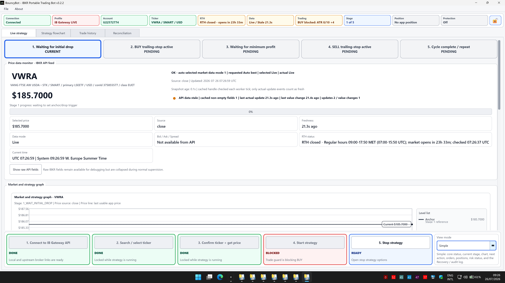
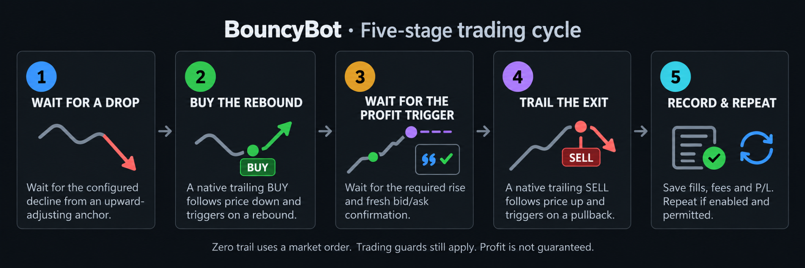
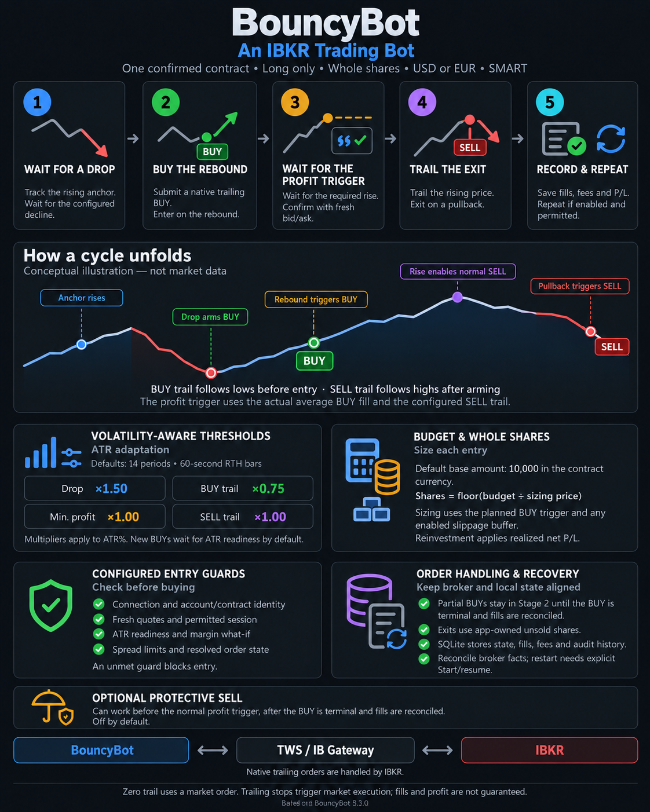
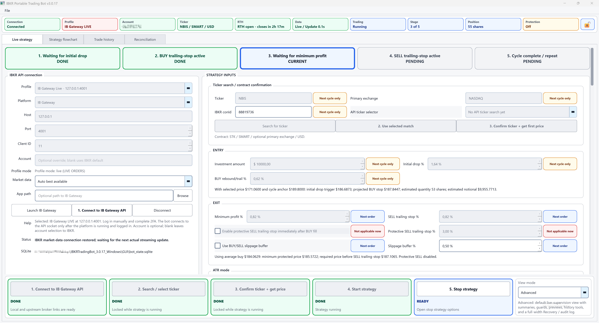
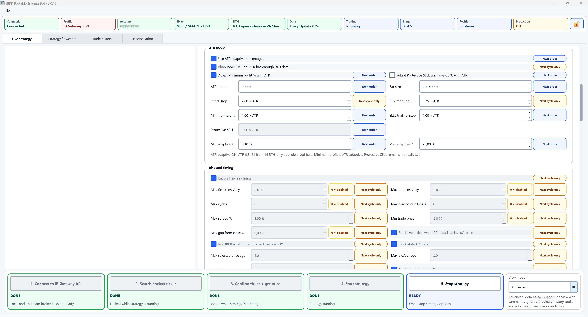
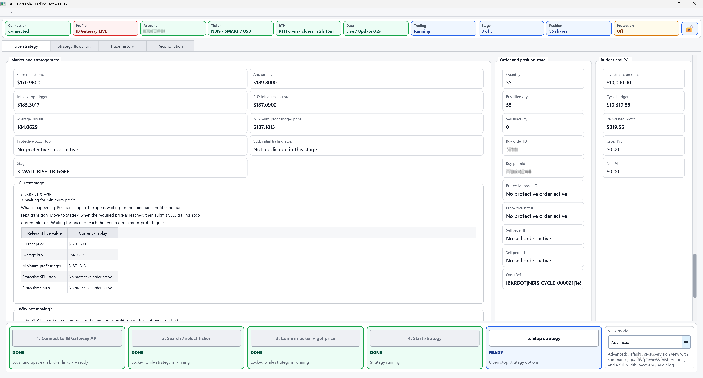
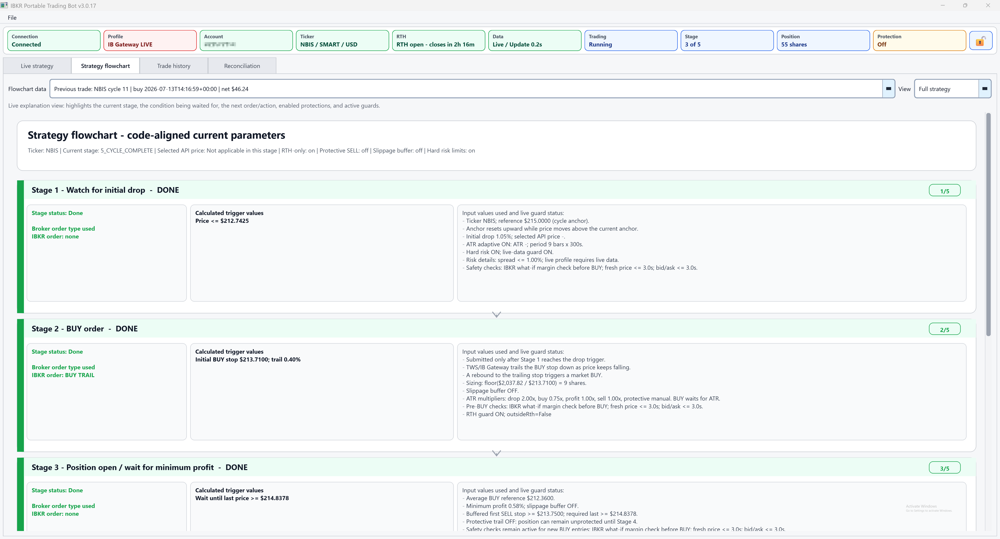
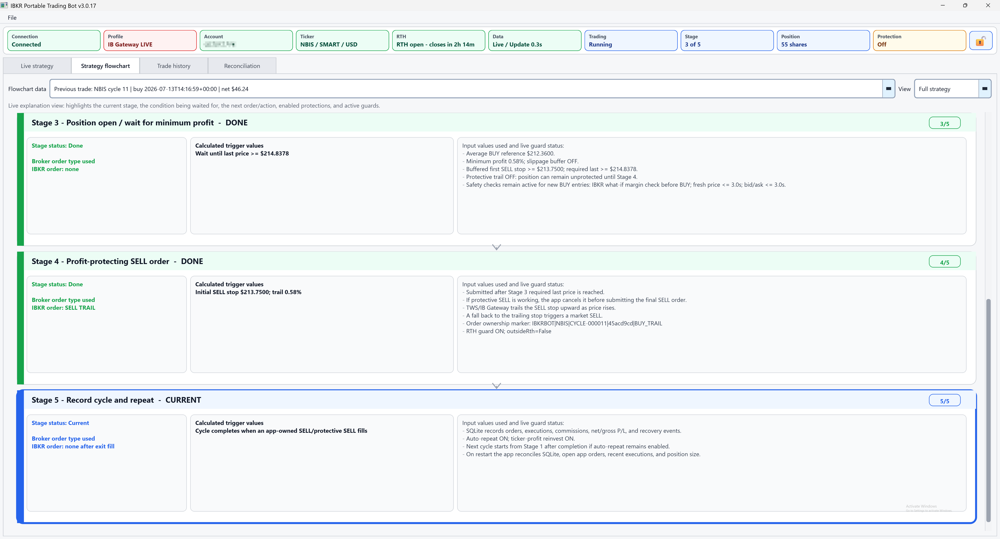
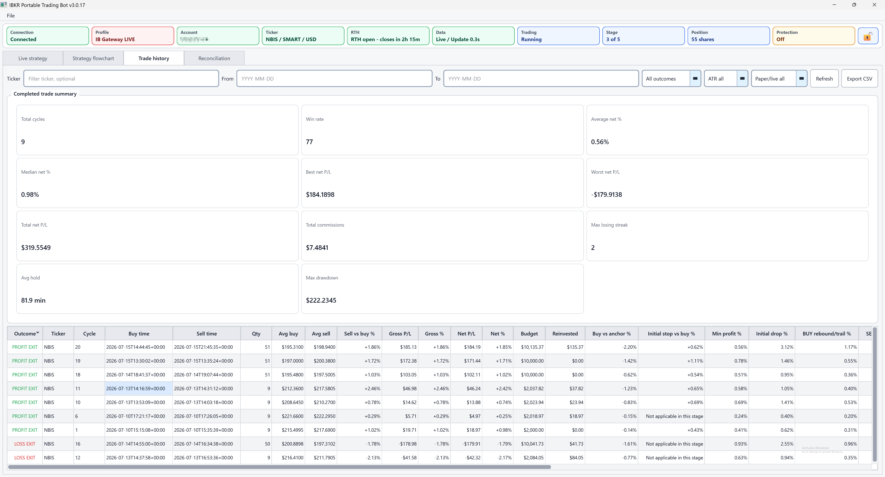
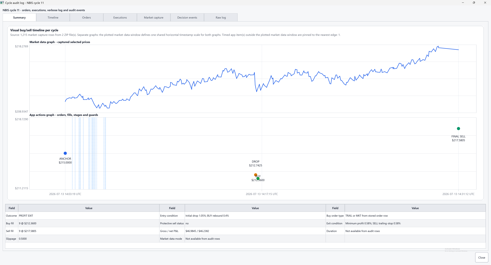

# BouncyBot - an IBKR Trading Bot

<p align="center">
  
</p>

**Current release: v5.7.0**

Version 5.7.0 lets an already partially filled marketable BUY finish on its original broker order. It removes the three-second remainder timeout and automatic post-fill cancellation for market-data or entry-guard changes. Explicit Stop/close requests and the separately configured pre-close BUY cancellation remain available. This applies to both direct market BUYs and native trailing BUYs once they have triggered and partially filled.

Unknown submissions, unresolved exits, identity mismatches and insufficient positions remain blocked. The five-stage strategy, order-sizing rules, RTH/quote safeguards and backup policy are retained. See the [release and upgrade notes](docs/V5_7_0_PARTIAL_BUY_COMPLETION.md) and [implementation and test report](IMPLEMENTATION_TEST_REPORT.txt) for the exact scope, executed checks and remaining platform gates.



BouncyBot is a Windows desktop application that automates one long-only stock-trading cycle at a time through Interactive Brokers Trader Workstation (TWS) or IB Gateway.

BouncyBot watches a confirmed stock contract, waits for a configured decline, enters on a rebound, and waits for its minimum-profit condition before submitting the normal exit. An optional protective SELL can be submitted earlier, after the BUY is terminal and its fills are reconciled.

Orders use IBKR-native trailing stops or market orders. The app stores its state in a local SQLite database and provides recovery, audit and diagnostic tools for its own orders and fills.

> [!CAUTION]
> This software can transmit live orders. Native trailing stops trigger market-style execution and do not guarantee a stop price, fill price, or profit. Gaps, latency, insufficient liquidity, rejected orders, commissions, and broker behavior can produce results that differ from the application projections. Review the settings, broker permissions, market-data subscription, and recovery state before enabling live trading.

> [!NOTE]
> This repository is source-available under the [PolyForm Noncommercial License 1.0.0](LICENSE). Noncommercial use, modification, and redistribution are permitted under its terms; commercial use requires separate permission from the licensor.

## Contents

- [What the bot does](#what-the-bot-does)
- [Trading cycle](#trading-cycle)
- [Core features](#core-features)
- [Screenshots](#screenshots)
- [Advanced features](#advanced-features)
- [What the bot does not do](#what-the-bot-does-not-do)
- [Requirements and dependencies](#requirements-and-dependencies)
- [Installation](#installation)
- [IBKR setup](#ibkr-setup)
- [Using the application](#using-the-application)
- [Data, backups, and diagnostics](#data-backups-and-diagnostics)
- [Repository safety](#repository-safety)
- [Testing and Windows builds](#testing-and-windows-builds)
- [Project structure](#project-structure)
- [Documentation](#documentation)
- [Release history](#release-history)
- [Thank me](#thank-me)
- [License](#license)

## What the bot does

<p align="center">
  
</p>

The bot implements a five-stage strategy for one confirmed IBKR stock contract:

1. Watch for an initial percentage drop from a rising anchor.
2. Enter with a native BUY trailing stop, or a market BUY when the BUY trail is configured as zero.
3. Wait until a SELL order can protect the configured minimum gross profit relative to the actual average BUY fill.
4. Exit with a native SELL trailing stop, or a market SELL when the SELL trail is configured as zero.
5. Record the completed cycle and optionally start another cycle.

The strategy is long-only. It buys whole shares and then sells only the quantity attributed to the application’s recorded fills. Orders created by the application use an `OrderRef` beginning with `IBKRBOT|`. Because multiple portable instances can share a Master API feed, ownership is accepted only when the complete `OrderRef` exactly matches a reference already persisted by that installation; a shared prefix alone is not sufficient.

The supported trading contract is an ordinary `STK` routed through `SMART`, denominated in USD or EUR, and selected from an exact IBKR API result with a positive `conId`. The selected symbol, `conId`, currency, security type, SMART route, and primary exchange are rechecked during qualification. Each portable SQLite database uses one contract currency, so local budgets, P/L, risk limits, and reinvestment are never combined across USD and EUR without an FX conversion model.

The application is portable: its SQLite database, logs, exports, backups, audit reports, and completed market-data captures are stored beside the source tree or packaged executable.

## Trading cycle

### Stage 1 — wait for the initial drop

The first usable strategy price becomes the anchor. Before the drop occurs, a new higher price raises the anchor. The manual drop level is:

```text
drop trigger = anchor × (1 - initial drop % / 100)
```

When ATR-adaptive mode and **Block new BUY until ATR has enough RTH data** are both enabled, the manual initial-drop percentage is not used during ATR warmup. Stage 1 has no armed drop trigger until enough regular-trading-hours samples exist. The first ready ATR update establishes a fresh anchor; only a later price update can satisfy the ATR-derived drop.

### Stage 2 — enter on a rebound

After the drop condition is met, the projected BUY stop is:

```text
projected BUY stop = current price × (1 + BUY rebound/trail % / 100)
quantity = floor(budget / sizing price)
```

The sizing price is the projected BUY stop, optionally increased by the configured planning-only slippage buffer. A positive BUY trail creates a native IBKR `TRAIL` order. A zero BUY trail creates a market BUY immediately after the drop condition.

When a positive BUY quantity first fills, the original marketable BUY remains working until IBKR reports it terminal. There is no partial-fill timeout, and stale quotes or other entry-guard changes do not automatically cancel its remainder. Explicit operator Stop/close requests and the separately configured pre-close BUY cancellation still apply. Stage 2 remains active until the original BUY order is terminal, and all additional fills received before or during any requested cancellation are reconciled into the app-owned quantity, weighted average price, commissions, later SELL sizing, and P/L. A terminal partial settles only the quantity actually acquired; the bot does not place a top-up order. Execution and commission callbacks remain idempotent by IBKR execution ID, including callbacks that arrive after order polling or reconnect.

### Stage 3 — wait for minimum profit

The actual average BUY fill is the profit reference. Without the optional slippage assumption:

```text
minimum initial SELL stop = average BUY fill × (1 + minimum profit % / 100)
required rise-trigger price = minimum initial SELL stop / (1 - SELL trail % / 100)
```

The final SELL requires a complete, non-crossed bid/ask pair with each side independently fresh. A positive **Maximum spread %** also limits the spread; setting it to zero disables that ceiling, not the freshness checks. The executable SELL-side bid must confirm the rise trigger on two consecutive distinct quote updates. The quote identity is revalidated before recording the durable order intent and again before broker submission.

An unchanged cached Last or a size-only update cannot supply a new SELL confirmation. A fresh bid/ask update can still confirm the exit when the displayed selected price comes from a cached Last. The trigger remains a gross planning threshold before commissions and actual market-order slippage; it is not a profit guarantee.

When **Cancel SELL trail and liquidate before close** is enabled, Stage 3 also evaluates the configured cutoff. It requires a fresh complete quote, a bid strictly above the actual average BUY fill price, and compliance with any enabled spread ceiling. The resulting market SELL is RTH-only with `DAY` time in force; commissions are intentionally ignored for the above-BUY comparison. If a protective SELL is still working, the app cancels it and waits for a terminal broker status before submitting the market order. The quote test occurs before submission and cannot guarantee that the eventual market fill remains profitable.

### Stage 4 — manage the exit

A positive SELL trail creates a native SELL `TRAIL` order. A zero SELL trail creates a market SELL after the minimum-profit condition is reached. The broker controls the native trail after order submission.

The optional **Cancel SELL trail and liquidate before close** policy is off by default and uses the contract's date-specific RTH close. In Stage 4, the app starts the workflow at the configured number of minutes before close, requests cancellation of the final native SELL trail, waits for a terminal broker state, recalculates the remaining app-owned quantity from the idempotent execution ledger, and submits one `DAY` market SELL with `outsideRth=False`. A fill during the cancellation race is recorded normally; a partial trail fill reduces the replacement quantity. The market exit can fill below the trailing stop and can realize a loss. If cancellation is not confirmed before close, no second SELL is submitted. If cancellation succeeds but the replacement cannot be submitted or completed before close, the cycle moves to an error/manual-review state rather than submitting outside RTH.

An optional protective SELL trail can be submitted after the BUY becomes terminal and its acquired quantity is reconciled. It is not placed on the first partial fill while the BUY remainder is still working. When the normal minimum-profit exit becomes eligible, the application validates the replacement, requests cancellation of the protective order, waits for confirmation, and revalidates before submitting the final SELL. Failed or uncertain protection becomes a visible recovery condition; separate cancellation and submission cannot guarantee uninterrupted protection.

### Broker price validation and rejection handling

Before a trailing order is submitted, BouncyBot reads the selected contract's exchange-specific IBKR market rule when one is advertised. The app selects the increment for the proposed price, rounds BUY prices upward and SELL prices downward, and blocks submission if the advertised rule cannot be resolved. `ContractDetails.minTick` remains only a fallback for contracts that do not advertise a market rule.

The optional IBKR what-if check fails closed on missing or invalid order state, rejection warnings, unset values, or absent margin/equity output. App-owned broker error callbacks are retained in the audit trail. An unfilled BUY that becomes `Inactive` or `Rejected` stops in `ERROR` for manual review instead of automatically resetting and repeatedly resubmitting the same invalid order. A normal confirmed cancellation still returns Stage 2 to Stage 1.

### Stage 5 — complete or repeat

The application records fills, commissions received from IBKR, gross and net P/L, timing, order references, and audit events. With auto-repeat enabled, another cycle can start when **Stop after current cycle** is off and the enabled maximum completed-cycle cap has not been reached. Unresolved application cycles, orders or shares, and inconsistent execution identity also block automatic repetition. New BUYs remain subject to the normal trading guards.

## Core features

- PySide6 desktop GUI with connection, strategy, flowchart, history, and reconciliation views.
- Light Fusion appearance at every startup, neutral Qt Fusion-style dark colors available through **View > Dark mode**, explicit **View > Light mode** switching, and theme-aware custom-painted audit/strategy visualizations.
- TWS and IB Gateway connection profiles for live and paper endpoints, with a fixed ten-second local API reconnect cadence that continues indefinitely until reconnection, manual Disconnect, or shutdown.
- Exact USD/EUR ordinary-stock contract selection through the IBKR API, with SMART routing, positive `conId` verification, route-specific market-rule price increments, order-capability checks, and one contract currency per portable database.
- Whole-share budget sizing.
- Native IBKR BUY and SELL trailing-stop orders with side-aware broker-price normalization.
- Optional Stage-3 profitable market liquidation and Stage-4 cancel-confirm-market liquidation before the contract-specific RTH close.
- Market-order alternatives when a trail percentage is exactly zero.
- Optional automatic cycle repetition and reinvestment of positive cumulative net P/L from completed application cycles (losses offset gains).
- Portable SQLite persistence and additive schema migration.
- Atomic resume checkpoints for normal exits and controlled Windows update/sign-out/shutdown requests.
- Single-instance lock to reduce the risk of two copies using the same database and API client configuration.
- UTC audit timestamps throughout the application, with live receipt time and broker-decoded execution time preserved separately.
- Stateful audit diagnostics that use stable reason codes, suppress cadence-level duplicates, retain structured occurrence/maximum evidence, and emit bounded persistence summaries plus recovery events while the Price Data Monitor shows the current Stage-3 quote guard continuously.
- CSV trade-history export and diagnostic audit bundles.
- BouncyBot application branding and an **About > Info** screen with the project repository, referral link, and copyable support addresses.

<p align="center">
  
</p>

## Screenshots

<p float="left">
  
  
  
</p>
<p float="left">
  
  
  
</p>
<p float="center">
  
  
</p>

## Advanced features

### ATR-adaptive percentages

ATR mode derives selected strategy percentages from application-observed, RTH-only API prices grouped into fixed-duration OHLC bars. These are not broker-provided historical bars. The defaults are:

| Setting | Default |
|---|---:|
| ATR period | 14 true-range periods (15 observed bar buckets required; the newest may still be forming) |
| Bar duration | 60 seconds |
| Initial drop multiplier | 1.50 × ATR% |
| BUY rebound multiplier | 0.75 × ATR% |
| Minimum-profit multiplier | 1.00 × ATR% |
| SELL trail multiplier | 1.00 × ATR% |
| Optional protective SELL multiplier | 3.00 × ATR% |
| Percentage clamp | 0.10% to 20.00% |

ATR adaptation is enabled by default. Minimum profit is adapted by default; protective SELL adaptation is optional and off by default. New entries are blocked during ATR warmup by default.

RTH observations and diagnostic ATR bars are collected even while adaptation is disabled. In that state the GUI can show warmup/readiness, but no strategy percentage is changed. Collection pauses outside RTH. The observation buffer is held in memory for the current application session and is reset when the process restarts; it is not a broker historical-bar cache.

A validated ready ATR estimate is checkpointed in the SQLite `app_settings` table for the exact confirmed contract, currency, venue, trading/data profile, ATR period, and bar duration. At a verified open RTH session, that estimate can supply the starting ATR/ATR% while current-session bars warm up. It does not insert synthetic observations or make a quote fresh. The first ready current-session calculation replaces it. The GUI identifies the saved session and today's observed bar count.

ATR continues updating in memory throughout RTH. Checkpoints are saved only in the **last five minutes of the broker-reported RTH window** (at most once per minute), with a final session-close flush and an **orderly app-close save**. The five minutes control saving, not the ATR lookback. There are no routine intraday checkpoint writes. Transient RTH-status loss and midday identity/configuration edits do not force a save. After a crash before the closing window, the last previously saved valid estimate is reused, not necessarily today's latest intraday value; first use still warms up if no valid checkpoint exists. Failed final saves retry at a bounded one-minute interval. Existing v4.0.0 checkpoints remain compatible.

The seed must be no more than 24 elapsed UTC hours old (the exact 24-hour boundary is accepted) and must contain finite positive, internally consistent values observed inside its recorded RTH window. A next-session or same-session estimate is eligible only within that age limit; weekend and longer holiday gaps require normal warmup. The application does not guess exchange holiday calendars. First use, an expired/corrupt/mismatched checkpoint, or a changed ATR period/bar duration without a matching checkpoint retains normal warmup. A database from before ATR checkpoint support also requires normal warmup until its first valid estimate is saved. A same-session application/watchdog restart can reuse a valid checkpoint. Current market-data, opening-delay, RTH, gap, spread, two-observation SELL, and broker-reconciliation guards still apply. A saved estimate is not evidence that today's volatility is unchanged.

### Gateway connectivity and quote freshness

The application tracks two independent connection facts:

- the local API socket between the application and TWS/IB Gateway;
- the upstream connection between TWS/IB Gateway and IBKR servers.

A running Gateway can retain the local socket while its Internet/server connection is unavailable. IBKR connectivity messages are therefore handled separately from `isConnected()`:

- **1100/2110:** immediately invalidate market-data freshness and pause strategy advancement, broker-order polling, and new order submission;
- **1101:** reconcile app-owned orders/executions and create new market-data subscriptions because the old requests were lost;
- **1102:** reconcile app-owned orders/executions, retain the existing subscription handle, but still require a post-recovery ticker event before prices become strategy-usable again;
- **10197:** treat a competing IBKR market-data session as a quote-delivery outage, invalidate cached values, and wait for a new streaming event without assuming that the order/API channel is disconnected;
- **2103/2104:** invalidate quote freshness when a market-data farm disconnects or reports restored, then require the next actual ticker event before treating the feed as fresh and usable again;
- **1300:** treat the API socket-port reset as unavailable and require a normal local reconnect.

Freshness is based on actual `ib_async` `pendingTickersEvent` deliveries and, within each delivery, on the raw price field that actually updated. Bid, ask, and Last have independent update/change sequences and callback times. Re-reading a `Ticker` object whose fields remain populated does not refresh their ages. A bid-size, ask-size, Last-size, or timestamp event cannot make an unchanged price field fresh, while a same-price bid/ask/trade price tick remains a valid field update. The selected `marketPrice` is traced back to its Last, quote, mark, or close basis, so an unchanged cached Last exposed when one quote side disappears cannot advance the strategy or enter ATR. Quote age is re-evaluated on every GUI snapshot, so a formerly green indicator changes to stale even when the worker temporarily performs no new quote read. Fields may remain visible for diagnosis, but cached, invalidated, or stale values are not tradeable. If the supported adapter cannot register ticker events or field-level evidence, the affected trading path fails closed.

After upstream restoration, normal processing remains paused until the application has reconciled app-owned open orders and recent executions. Native orders already accepted by IBKR are not automatically cancelled solely because connectivity is lost; their status and fills are imported during recovery when broker facts become available.

### Entry and market-data guards

The controller evaluates configured blockers before a BUY is transmitted. The top **Trading** status shows a compact blocker summary; its tooltip lists all currently evaluated blockers.

The regular-session open/close window comes from the exact qualified IBKR contract's date-specific `liquidHours` and `timeZoneId`. For `LSE` and `LSEETF`, BouncyBot intersects that broker window with the verified 08:00-16:30 `Europe/London` continuous session, so ordinary timing-sensitive orders do not use a later auction/post-continuous `liquidHours` endpoint. An IBKR holiday or earlier close still wins. The same effective boundaries drive the first-minutes, last-minutes, cancel-before-close, and RTH-only ATR controls. RTH comes from IBKR contract-session metadata, not price ticks. Guessed weekday hours and timezone substitutions have been removed. Missing or invalid authoritative session metadata blocks RTH-restricted submissions for every contract; the GUI does not invent session hours or a countdown.

When a BUY is prevented before any live order is submitted, the cycle records `PreflightBlocked` rather than `SubmitFailed`. Persistent preflight, reconnect, Stage-3 quote-evidence, close-before-RTH, and native-order waiting conditions are coalesced into a condition-entry event, bounded periodic summaries, and one recovery event instead of one SQLite audit row per controller cadence. The safeguards themselves remain evaluated and enforced on every cadence, and safety-critical rejections, quantity mismatches, worker/storage faults, reconciliation failures, and confirmed pre-submission SELL revalidation failures remain immediate.

Depending on configuration and runtime state, blockers include:

- a disconnected local API socket, lost Gateway-to-IBKR server link, or incomplete post-reconnect reconciliation;
- no actual post-connect/post-recovery ticker event, or missing, invalid, cached-only, or stale selected price;
- stale or missing bid/ask data;
- unknown, stale, or closed RTH status;
- delayed or non-live data in live trading;
- ATR warmup;
- first/last minutes of the regular session;
- excessive spread relative to the fixed user-configured **Maximum spread %**, or an excessive previous-close gap;
- minimum trade price;
- recent observed volatility;
- configured daily-loss, cycle-count, or loss-streak limits;
- an unresolved application-owned long quantity;
- what-if, market-rule, preflight, order-submission, broker-rejection, or protective-order cancellation failures.

Recovery displays expected guard/session pauses as caution states and distinguishes them from broker/local-state inconsistencies requiring reconciliation. Workflow cards use their own colors: a red **BLOCKED** card can also mean an ordinary prerequisite is unmet, so read its reason before treating it as a recovery fault. The Maximum spread field is never rewritten from live bid/ask data; only explicit user edits and loading the saved setting can change it.

### Optional account routing

The Account field is optional for a new cycle when IBKR reports one unambiguous managed account. The application resolves and persists that account before placing orders; every order remains pinned to the cycle account. With multiple managed accounts, select one explicitly. Recovering an exposed historical cycle with a blank account requires exact owned-order/execution evidence.

### Application-owned position scope

An existing long position acquired manually or by another program does not, by itself, block a new application BUY. The BUY blocker uses unsold quantity reconstructed from this application’s persisted BUY and SELL fills. A cycle marked **manually handled** is treated as operator-resolved.

IBKR positions are account-level values and individual shares are not tagged by originating application. The application-owned quantity is therefore a local accounting boundary, not broker-side lot segregation. Combining external and application-owned shares in one account can complicate tax lots, manual selling, and reconciliation.

### Recovery and reconciliation

Open **Reconciliation** using the button at the right of the tab row. It compares local SQLite state with app-owned open orders, the broker position and recent executions reported by IBKR:

1. **Refresh from IBKR/TWS** to retrieve current broker facts without placing, modifying, or cancelling an order.
2. Compare SQLite with the returned orders, position, and executions.
3. Choose a resolution action only after the comparison is understood.

The comparison table fits all eight wrapped rows without an internal scrollbar. Its columns use the available width and its rows refit after resizing, font/style changes or data updates. If the window is too short, the page scrolls to keep the table and actions accessible. The four guided actions use a two-by-two grid; the advanced action area follows its content height.

The screen shows whether the broker probe is **Not refreshed**, **Current**, **Stale**, or **Refresh failed**, including the last successful refresh time when a later attempt fails. A successful probe remains current for at most 60 seconds and only while it matches the active cycle's reconciliation-relevant stage, order, and fill facts. Ordinary price updates do not invalidate it; a disconnect, upstream outage, or reconciliation-relevant local/broker change does.

**Reconcile and resume**, **Cancel visible app-owned orders**, **Sell app-bought unsold position**, and **Leave orders working** remain disabled until the probe is current; the same check is repeated when the button is clicked. **Stop after current cycle** is a local intent action and does not require a current broker probe. **Mark manually handled** remains an explicit manual override, but when the probe is not current its confirmation requires independent TWS verification. Audit export remains available.

A configured BUY guard (including ATR warmup), an ordinary strategy wait, or a safe completed cycle is not treated as an actionable recovery fault. On an ordinary launch, a stored active cycle does not resume automatically: the operator must connect and explicitly start/resume monitoring. A sufficiently stale active cycle is put into recovery-required state. Broker-probe rows are point-in-time facts: a newer terminal poll for the same app order retires an older probe row so a completed cycle is not falsely presented as still working.

### Worker watchdog and unattended process restart

The Qt GUI independently monitors delivery of the controller worker's normal 0.5-second snapshots. After 3 seconds without a new snapshot it reports **Worker delayed**; after 15 seconds it replaces cached green connection/data/RTH indications with an explicit unresponsive state; after 30 seconds it requests a full-process restart. If the worker thread has terminated, restart is requested immediately after a short startup grace period. The stale-data age continues to increase in the GUI and RTH becomes **Unknown** rather than remaining frozen at the last worker value.

The restart path exits Qt, shuts down as far as possible, releases the portable-folder lock, and uses a properly quoted `subprocess.Popen` argument list on Windows and `os.execv` on POSIX to relaunch the complete source or packaged process. It never starts a second controller thread or overlapping BouncyBot process. A one-time restart token authorizes only the immediate replacement process. Automatic strategy recovery is permitted only when the final healthy snapshot proved that monitoring was active and the exact persisted cycle ID, stage, contract identity, order references, and broker-relevant signature still match. The replacement then uses the existing IBKR connection and reconciliation path; any contract, order, fill, position, execution, recovery, or fresh-data uncertainty remains fail-closed for manual review. Ordinary manual launches still require an explicit Start.

A SQLite failure activates a separate storage-fault state. All strategy work and broker-changing calls are blocked, error reporting falls back to `debug_reports/worker_emergency.log`, and a short independent write transaction probes whether the database is usable again. A healthy worker is replaced only after that write probe succeeds; a dead or hard-stalled worker is replaced even when the last snapshot reported a storage fault. Restart-loop protection permits three rapid attempts in 15 minutes and then waits five minutes between further attempts. Automatic replacement is enabled by default and can be disabled with `IBKR_BOT_AUTO_RESTART=0`.

See [Worker watchdog and automatic recovery](docs/WORKER_WATCHDOG_AND_AUTO_RECOVERY.md) for exact gates, diagnostics, and limitations.

### Stop choices

The Stop dialog shows the choices applicable to the current cycle, visible orders and app-owned quantity:

- **Cancel open bot orders** requests cancellation of app-owned orders.
- **Sell app-bought unsold position with market order** cancels working app-owned orders as needed and sells the remaining app-owned quantity after cancellation is confirmed. It requires a separate potential-loss confirmation.
- **Leave orders working and recover later** disconnects the app while leaving broker orders in place for later recovery.
- **Stop after current cycle / no next cycle** allows the current cycle to finish without repeating.
- **Stop strategy now** stops the local cycle without cancelling or submitting broker orders.
- **Stop strategy and exit app** also closes the app after the local stop is confirmed.
- **Exit app and resume/recover later** preserves the active cycle for a later explicit resume, without a stop, cancel or SELL command.
- **Exit app** is shown when no cycle is running and no app-owned open orders or unsold quantity are detected.

**Cancel** closes the dialog without choosing an action. Closing the main window opens the same decision path.

### Market-data capture and audit tools

A bounded in-memory market-data buffer supports per-fill debug capture. After a BUY or SELL fill, the capture contains up to 15 minutes before and 15 minutes after the event. The ZIP is written only after the post-event window completes; an incomplete capture is intentionally lost if the process closes early. A verified fill capture can contain the same instrument after Auto-repeat starts another cycle. The audit display retains those prices within the capture window, including post-SELL context, without importing the next cycle's orders or decisions. Archives without complete identity/window evidence retain strict cycle filtering.

## What the bot does not do

This project is intentionally limited. It does not:

- trade multiple tickers or independent cycles concurrently;
- open short positions;
- trade non-`STK` contracts, such as options, futures, forex, bonds or crypto;
- support contract currencies other than USD and EUR, direct/non-SMART routing, or mixed-currency cycles in one portable database;
- convert commissions, P/L, budgets, risk limits, or reinvestment between currencies;
- manage arbitrary manual orders or orders from other software;
- treat an account-wide IBKR position as wholly owned by the application;
- provide broker-side lot identification for application-created versus external shares;
- guarantee entry price, stop price, exit price, minimum net profit, or protection against gaps;
- calculate taxes, wash sales, tax-lot selection, borrow availability, corporate-action adjustments, or portfolio exposure across other holdings;
- replace TWS/IB Gateway login, authentication, two-factor approval, trading permissions, market-data subscriptions, or broker risk controls;
- operate when the controlling application is closed except for native orders already accepted and held by IBKR;
- guarantee that a fill, cancellation, or protective-order placement will be observed or acted on while the local API or Gateway-to-IBKR server connection is unavailable;
- provide high-availability failover, redundant Internet connectivity, or a second controller process for the same cycle;
- restart itself when the Qt main event loop, the complete process, Windows, storage device, or machine is frozen or unavailable; the built-in watchdog runs in the Qt GUI thread and can replace only a process whose GUI event loop is still executing;
- automate TWS/IB Gateway login, credentials, two-factor approval, Gateway startup after a complete platform failure, or operating-system recovery;
- reconstruct incomplete in-memory market-data captures after shutdown;
- provide exchange-native historical ATR bars or persist ATR observations across restarts; ATR uses RTH prices observed by the current running application;
- serve as investment advice, a hosted service, or a high-availability trading system.

## Requirements and dependencies

### Runtime prerequisites

- Windows 10 or later is the intended desktop and packaging environment.
- Standard GIL-enabled CPython 3.14.x when running from source.
- Interactive Brokers TWS or IB Gateway with API/socket access enabled.
- An IBKR account with appropriate trading permissions.
- Suitable real-time market data for live operation. Delayed/frozen data may be displayed, but configured guards can block live BUY orders.

### Python dependencies

| Package | Constraint | Purpose |
|---|---|---|
| `PySide6` | `>=6.10.1,<7` | Desktop GUI and Qt signals |
| `ib_async` | `>=2.1.0,<3` | IBKR TWS/Gateway socket API wrapper |
| `tzdata` | `>=2025.2` | IBKR contract timezones and the London continuous-session policy |
| `PyInstaller` | `>=6.21,<7` | Windows portable executable build |
| `pytest` | `>=8.4.2,<9` | Automated tests |
| `coverage` | `>=7.10.7,<8` | Statement, branch, and per-callable test-coverage gates |
| `ruff` | `>=0.14,<1` | Required lint/import quality gate |
| `pyright[nodejs]` | `>=1.1.407,<2` | Required type-check quality gate with bundled Node runtime where available |

The complete local development/build set is installed from `requirements.txt`. Runtime package metadata is in `pyproject.toml`. These are version constraints, not a deployment lockfile; record the exact installed versions when qualifying a build.

## Installation

### Option A — Windows launcher

1. Clone or download the repository into a writable folder.
2. Install standard GIL-enabled CPython 3.14.x. The standard Python launcher (`py`) is supported.
3. Double-click `run_dev.bat` from the project root.

The launcher creates `.venv` if needed, upgrades `pip`, installs `requirements.txt`, clears test-only environment variables, and starts the GUI. Its `ExecutionPolicy Bypass` setting applies only to that PowerShell process; it does not change the machine-wide PowerShell policy.

An older `.venv` is rejected before package changes. With the app closed, retain your database/backups and rename the old environment to `.venv-pre-5`, then let the launcher create a standard Python 3.14 environment. Source changes do not update the interpreter inside an existing executable; rebuild it on Windows and validate paper-broker recovery before deployment.

### Option B — command line

From PowerShell in the project root:

```powershell
py -3.14 -m venv .venv
.\.venv\Scripts\python.exe -m pip install --upgrade pip
.\.venv\Scripts\python.exe -m pip install -r requirements.txt
.\.venv\Scripts\python.exe main.py
```

The project does not require a system-wide package installation.

## IBKR setup

Before connecting:

1. Start TWS or IB Gateway and complete login and two-factor authentication.
2. Enable socket/API clients in the platform settings.
3. Confirm that the socket port matches the selected profile.
4. Confirm that the API client ID is not already used by another connected client.
5. Confirm trading permissions and market-data subscriptions for the intended stock.
6. Keep read-only API mode disabled when order transmission is required.

Default profiles:

| Profile | Host | Port |
|---|---|---:|
| IB Gateway live | `127.0.0.1` | `4001` |
| IB Gateway paper | `127.0.0.1` | `4002` |
| TWS live | `127.0.0.1` | `7496` |
| TWS paper | `127.0.0.1` | `7497` |

Host and port remain editable. The optional Start helper can launch a configured local TWS or Gateway executable, but it does not store credentials or complete authentication.

## Using the application

### 1. Connect

If the GUI is locked, unlock it with the top lock button to restore the workflow buttons and view-mode selector. Select **Advanced** or **Debug** to edit connection and strategy settings.

Select the TWS/Gateway profile, host, port, client ID, market-data mode, and optional account override. Click **1. Connect to IB Gateway API** or **1. Connect to TWS API**, according to the selected profile. A blank account requests automatic selection of one unambiguous managed account before a new cycle. The Connection indicator distinguishes a local socket connection from the Gateway/TWS upstream IBKR link; **Waiting for IBKR** means the local process is reachable but trading is paused because upstream connectivity is not confirmed. Contract search, ticker confirmation, and strategy start stay disabled until the upstream link is ready and any post-restoration reconciliation has completed. After an enabled local API connection is lost, BouncyBot retries every ten seconds without an attempt limit. Manual **Disconnect** and application shutdown stop those retries.

### 2. Search for a contract

Enter a stock symbol and use **2. Search / select ticker**. Choose the exact ordinary `STK` result with the intended positive `conId`, USD or EUR currency, and primary exchange. Routing remains `SMART`. Editing the ticker invalidates the prior exact selection, and a database with completed or active cycles rejects results in the other contract currency.

### 3. Confirm the ticker and price

Use **3. Confirm ticker + get price**. The application rechecks the selected symbol, `conId`, currency, ordinary `STK` type, SMART route, primary exchange and required order capabilities. It retains IBKR session metadata for the separate RTH check. Missing or unusable hours/timezone data leaves RTH unavailable and blocks RTH-restricted submissions. Review the selected price source, bid/ask, **actual update age**, update sequence/subscription identity, market-data type, contract minimum tick, and RTH state. The applicable market rule is resolved at order-preflight time and recorded in order diagnostics. A cached value can remain visible after an outage, but it is labelled cached-only and does not count as a fresh update.

### 4. Configure and start

Review the investment amount, manual or ATR-derived percentages, protective exit, slippage planning, repetition, reinvestment, stale-data/session guards, and optional hard limits. Click **4. Start strategy**.

The top lock button prevents accidental editing. When locked, editable configuration controls remain disabled and the entire Live strategy bottom bar containing the five workflow buttons and view-mode selector is hidden. Unlocking restores the bar with each button subject to its existing state-dependent permissions. The top lock, monitoring, tab navigation, history and Reconciliation remain available.

The ten equal-width status boxes and compact lock control sit above the five-stage ribbon. Both rows remain visible while scrolling or changing tabs. Long status text wraps within its box. The top Ticker box shows **N/A** when no ticker name is available; populated labels retain their identity details.

**Connection** reports the local API and upstream IBKR links, independently of quote freshness. With both links available and reconciliation complete, it stays **Connected** while data is stale or awaits an update. **Data** separates the subscription type from freshness: **Live / Stale** means the live subscription has an old last actual update, not that its price is currently tradeable. A known old update has the same stale label whether or not a recovery/farm notification also requires another event; the tooltip retains that waiting reason. Missing update evidence remains a waiting/unknown condition. During an active cycle, temporary local loss shows amber **Reconnecting**, an unavailable upstream link shows amber **Waiting for IBKR**, and pending reconciliation shows amber **Reconciling**. The affected workflow cards show **Waiting**, while Trading shows **Paused: reconnecting** or **Paused: reconciling**. Actual manual-review, trading-risk and worker/storage faults retain their fault presentation; amber waiting does not authorize trading.

Live strategy, Strategy flowchart and Trade history stay on the left of the tab row. The **Reconciliation** button on the right opens that page and indicates when it is selected. It remains reachable while locked; keyboard users can focus the button with Tab and activate it with Space. Ctrl+Tab cycles the three visible left-side tabs and skips the hidden Reconciliation tab header.

The **Trading** status is the concise source for current BUY/SELL eligibility. Hover it to see all active blockers rather than only the first one. When closed RTH is accompanied only by stale/pending market-data blockers, the compact summary leads with **RTH closed**; the data blockers remain in the tooltip. Other faults retain their priority. Its top-right header value is **current displayed price / minimum-profit trigger**; reaching the trigger does not imply that quote or order-safety gates have passed. The **Position** value at the top-right is the cost of app-owned shares still held, including allocated recorded BUY commission, not market value or other account holdings. Both top-right values use the same font as their top-left titles; the main status and share quantity remain below the header. When disconnected and no account is known, the Account box shows N/A; a known saved/cycle account remains visible.

In every view mode, **Price data monitor** includes the **Market and strategy graph** directly below **Strategy progress** and above the five metric boxes. The separate graph area and the “Rolling graph buffer…” footer are removed. In Advanced and Debug, the connection/strategy configuration row comes first, followed by Price data monitor directly above **Market and strategy state**. Simple hides the configuration row, leaving Price data monitor as the first visible panel. Graph history and updates are unchanged.

The Price data monitor combines Data mode with streaming-update age and combines RTH status with UTC/system time. **Last market update** is the recorded receipt time of an actual market-data event; it is never substituted with the time the app reread a cached snapshot. **Cached snapshot checked** separately describes that read age. A stale or invalidated displayed price is identified as cached, and unavailable update evidence remains unavailable. **Show stage details** expands Current stage and Why not moving? beneath the market metrics; these diagnostics continue updating while collapsed. The top Stage status and ribbon show the current stage.

**Total buy cost** in Order and position state and **Invested** in Trade history both show actual cumulative BUY quantity times average BUY fill plus recorded BUY commission. They remain the full entry cost after a SELL; the top Position cost falls as shares are sold. Unknown fill facts are not replaced by a budget, and pending commissions can change the displayed cost. Long OrderRefs wrap as exact copyable plain text, using the same card background and proportional value font in light and dark modes, with internal scrolling for unusually long references.

The Strategy flowchart uses one text-fitting height for all five cards without shrinking their fonts. Narrower widths or longer text can increase that common height. A selected historical cycle is retained by cycle ID when history refreshes and uses that cycle's saved settings. The separate Strategy input map keeps its sixteen values and four lanes in a panel with a 420-pixel minimum height.

Expanding raw API fields fills the available width: content-sized Field columns alternate with stretching Value columns.

The Completed trade summary uses the same ticker, date, outcome, ATR and Paper/live filters as the history table. A blank ticker includes all tickers; clearing all filters includes every completed cycle in the portable database. The current strategy ticker does not restrict history totals. The table displays the latest 500 matching rows, while the summary includes all matching completed cycles. Filter changes refresh both views, and an earlier request cannot replace results for newer filters.

The Completed trade summary has three columns and four rows; **Average net P/L** follows **Best net P/L** and **Worst net P/L**. It is total realized net P/L divided by completed cycles, including losses and commissions. History keeps its horizontal scrollbar at the table viewport bottom even with many rows. The Invested column sorts numerically. **Export CSV** uses the same selected filters and exports all matching completed cycles without the display limit; its column schema is retained. Changes to completed-history records refresh the table and historical flowchart choices along with the summary, without repeatedly reading full history when its revision is unchanged.

In Cycle audit Timeline, each plot has an independent cursor. Hovering a plot shows its local time/price crosshair and record tooltip without drawing a cursor on the other graph. Moving to the other plot clears the previous overlay; leaving the plots or moving into the gap clears all hover guides. The single-graph Summary and other charts retain independent hover behavior; existing time-axis zoom and scrolling remain. Both lower Timeline tables retain equal height.

Orders and Executions use the full available width with OrderRef absorbing spare space. Market capture starts at the top even when no capture ZIP is available; its summary and preview fill the width and scroll independently. Decision events fills its tab.

Opening the audit dialog starts one read-only background worker to prepare capture data and decision display rows. Timeline and Market capture share the prepared data; Decision cells and wrapped row heights are added in bounded GUI batches. Closing the dialog cancels the work and discards late results. Other record tabs remain lazy. Timeline shows only actual changes between two recorded stages; all decision events remain available in Decisions.

The Cycle audit Summary details table refits when width, font/style or content changes. If wrapped rows exceed its height cap, a vertical scrollbar keeps all details accessible. Compact table sizing also reserves space for horizontal scrollbars where enabled. Zero-valued saved settings remain visible, and available order-type/timing fields supply the order details. Timeline's aggregate completion markers use the weighted average fill price; individual executions retain their actual recorded prices.

**Simple** hides the connection and strategy configuration panels, **Budget and P/L** and **Recovery / audit log**. **Advanced** and **Debug** show those panels, with the audit log at full dashboard width; Debug also expands raw API fields. Reconciliation and audit recording remain available in every mode. The five workflow buttons and view-mode selector are visible when unlocked.

### 5. Stop or close

Unlock the GUI if needed, then use **5. Stop strategy** and select the intended action. Closing the main window invokes the same stop decision path rather than silently abandoning the active state. Stop/exit quantity decisions come from the persisted application-owned fill ledger, not the account-wide broker position, so unrelated external shares do not create a SELL option.

When Windows requests an orderly session shutdown, such as an update restart, sign-out, or battery-triggered controlled shutdown, the app does not display a stop dialog. It writes the same durable state used by **Exit app and resume/recover later** and preserves the active cycle stage and app-owned broker orders. It does not stop the worker or exit from inside Qt's session callback, so the app remains usable if Windows shutdown is cancelled; when shutdown proceeds, normal event-loop cleanup stops the worker. On the next launch, reconnect and explicitly use **4. Start strategy** or the applicable Reconciliation action before monitoring resumes. A sudden total power loss or forced process kill cannot run this final hook; recovery then uses the most recent SQLite commits already on disk.

### Paper and live operation

The established connection profile defines paper versus live mode. Editing an idle connection profile does not change the active broker session: reconnect to apply it before starting a strategy. Live mode adds explicit warnings and guard behavior. Validate the entire workflow with an IBKR paper account and realistic market-data conditions before deciding whether to use live mode.

### About and project information

Use **About > Info** to view the BouncyBot logo, current application version, the project GitHub link, the IBKR referral link, and the same copyable support addresses listed in the [Thank me](#thank-me) section. The app always starts with the light Fusion appearance. Use **View > Light mode** or **View > Dark mode** to change the appearance for the current session.

## Data, backups, and diagnostics

The application writes these paths beside the project or packaged executable:

| Path | Contents |
|---|---|
| `bot_state.sqlite` | Settings, cycle state, orders, executions, decisions, broker events, and audit events |
| `backups/` | Full SQLite backups, including pre-migration copies. A new fully restore-validated backup rotates the folder to the newest 20 when deletion succeeds; startup alone does not prune |
| `exports/` | User-requested history and audit exports |
| `logs/` | Reserved generated-data directory; the current persistent readable audit log is under `debug_reports/` |
| `debug_reports/` | Human-readable audit log and latest state report; the periodic latest-state file refreshes at most once per 60 seconds unless forced |
| `debug_captures/` | Completed market-data capture ZIP files |
| `ibkr_trading_bot.lock` | Single-instance lock while the application is running |

Do not edit the live SQLite file manually while the application is running. Preserve the database together with the executable/source folder when moving the portable installation.

All app-generated timestamps are UTC. The GUI may also show system-local time for operator comparison, but persisted audit time remains UTC.

Before an accepted app exit or controlled Windows shutdown, `connection`, `strategy`, the current cycle, and `last_resume_checkpoint` metadata are committed together. The checkpoint also writes an audit event and requests a restore-validated online backup. Shutdown checkpointing applies safe editable fields without re-evaluating the last quote or issuing a broker action. It does not persist current-session ATR observations or an incomplete market-data capture.

Full backups are requested by lifecycle and trading events, not by a periodic full-backup timer. Order/fill paths enqueue backup requests; durable trading-state writes stay synchronous. The same controller worker later copies and fully validates the database, so the backup can still delay that worker and is a snapshot taken after the request. Restore validation retains integrity, required schema, foreign-key and disposable migration checks.

On first opening an unstamped or older database, the app attempts a pre-migration backup and records `PRAGMA user_version = 1` after schema work succeeds. Later openings with that current stamp skip the redundant startup copy while retaining idempotent schema checks. An unreadable or future schema stamp is rejected before migration, backup or database writes. Startup copies do not trigger retention pruning. See [database compatibility and backup details](docs/DATABASE_SCHEMA.md).

## Repository safety

Keep the active application directory on a writable local filesystem. Do not place the live SQLite database and its WAL/SHM sidecar files in OneDrive, Dropbox, a network share, or another continuously synchronized location; synchronize completed exports or selected backups instead.

The repository `.gitignore` excludes the normal database, backup, export, report, capture, test-output, virtual-environment, build, credential, and key-file paths. Before every public push, still inspect the staged file list and repository history. Files deleted from the working tree can remain accessible in earlier Git commits.

Never publish an unsanitized database, audit bundle, readable audit log, market-data capture, screenshot, or history export. These artifacts can contain account identifiers, positions, executions, order references, strategy settings, timestamps, local usernames, and filesystem paths. See [SECURITY.md](SECURITY.md) for reporting and sharing guidance.

## Testing and Windows builds

### Full Windows validation

Run:

```powershell
.\run_all_tests.bat
```

This verifies standard GIL-enabled CPython 3.14.x before installing dependencies or running tests, then performs Python compilation, every collected pytest test (including the bounded soak tests) with `ResourceWarning` checks, statement and branch coverage with a 75% minimum, a generated per-callable coverage check, a seventeen-mutant safety smoke gate, all deterministic CSV simulations, Ruff, and Pyright. The Windows full-test path applies no pytest marker filter. Every effective executable callable under `app/` and in `main.py` must be entered by at least one test. Failure at any required stage produces a nonzero result.

The offline suite includes broker-event permutations, generated controller state sequences, numerical/payload properties, recovery decision matrices, differential simulations, crash/restart and schema-migration cases, storage fault injection, Gateway outage sequences, and multi-instance isolation. The CSV gate validates 58 explicit scenario contracts across 54 price-path files, including threshold edges, gap fills, partial fills, RTH transitions, protective exits, slippage buffers, sizing, reinvestment, and zero-trailing market-order branches. These offline checks do not connect to IBKR or request live market/account/order data. Sanitized recorded evidence is used only by deterministic incident replays. GUI tests use Qt doubles or offscreen native widgets with an inert controller; they do not start live trading. See [Deterministic offline behavior tests](docs/OFFLINE_BEHAVIOR_TESTS.md) and [production incident replay tests](docs/PRODUCTION_INCIDENT_REPLAY_TESTS.md).

### Direct Python tests

```powershell
.\.venv\Scripts\python.exe scripts\check_python_runtime.py
.\.venv\Scripts\python.exe -m coverage erase
.\.venv\Scripts\python.exe -X utf8 -W error::ResourceWarning -m coverage run --branch --source=app,main -m pytest -q --tb=short -ra --disable-warnings
.\.venv\Scripts\python.exe -m coverage report --show-missing --fail-under=75
.\.venv\Scripts\python.exe -m coverage json -o coverage.json
.\.venv\Scripts\python.exe -m coverage xml -o coverage.xml
.\.venv\Scripts\python.exe scripts\check_callable_coverage.py --coverage-json coverage.json --source app --source main.py
.\.venv\Scripts\python.exe scripts\run_mutation_smoke.py
.\.venv\Scripts\python.exe scripts\run_all_simulations.py
.\.venv\Scripts\python.exe scripts\run_quality_checks.py --require-tools
```

On Unix-like development hosts, `scripts/run_tests.sh` performs compilation, non-soak pytest coverage, the per-callable gate, bounded soak tests, mutation smoke tests, and simulations. It does not run Ruff, Pyright, or the Windows packaging process.

### Build the portable Windows application

Run:

```powershell
.\build_windows.bat
```

The default build skips the test suite and leaves the PyInstaller folder-based output at:

```text
dist\IBKRTradingBot\IBKRTradingBot.exe
```

It also creates a versioned release folder and ZIP:

```text
release\IBKRTradingBot_5.7.0_Windows\
  BouncyBot.lnk
  GUI\IBKRTradingBot.exe
  docs\
  README.md
  CHANGELOG.md
  LICENSE
  SECURITY.md
  QUICK_START.txt

release\IBKRTradingBot_5.7.0_Windows.zip
release\SHA256SUMS.txt
```

To test before packaging:

```powershell
.\scripts\build_windows.ps1 -RunTests
```

`-RunTests` runs plain pytest and CSV simulations before packaging. It does not run the full coverage, callable, mutation, Ruff/Pyright or `ResourceWarning` gates above; run `run_all_tests.bat` separately for those checks.

To recreate the virtual environment as part of the build:

```powershell
.\scripts\build_windows.ps1 -CleanVenv -RunTests
```

PyInstaller writes detailed output to `build_pyinstaller.log`. Informational stderr output is not treated as failure when PyInstaller returns exit code zero and the expected executable exists.

The source `Images/` directory is not copied into the Windows release root. PyInstaller bundles only `BouncyBot_app_icon.png` and `BouncyBot_logo.png` inside the `GUI/` runtime tree because those two files are required by the executable. README screenshots remain in the source repository. The root `BouncyBot.lnk` records `GUI\IBKRTradingBot.exe` as its relative fallback, so it remains usable when the complete extracted release folder is moved; do not separate the shortcut from the `GUI/` folder.

## Project structure

```text
app/
  atr_memory.py            Validated saved RTH ATR estimates
  controller.py            Worker loop, guards, recovery, broker action execution
  flowchart_model.py        Pure flowchart/card model
  gui.py                   PySide6 interface and audit visualizations
  ib_adapter.py            IBKR adapter and native order construction
  ib_platform.py           TWS/Gateway profiles and launch helpers
  lockfile.py              Single-instance protection
  market_data_capture.py    In-memory pre/post-fill capture manager
  models.py                Serializable models, defaults, validation, calculations
  order_diagnostics.py     Native trailing-order diagnostics
  order_edit_policy.py     Reviewed settings edits before the next order
  paths.py                 Portable filesystem locations
  simulation.py            Deterministic simulation helpers
  storage.py               SQLite schema, persistence, backups, exports
  strategy.py              Pure five-stage state machine
  timeline_scaling.py      Audit-chart time and price scaling
  watchdog.py              Process-replacement handoffs and restart-loop limits

Images/                    BouncyBot branding, application icons, and screenshots
docs/                      Current guides; archived release notes are under docs/legacy/
scripts/                   Launch, test, simulation, quality, and build utilities
tests/                     Unit, integration, regression, and simulation tests
main.py                    GUI entry point
pyproject.toml             Package and quality-tool configuration
requirements.txt           Runtime, test, quality, and build dependencies
LICENSE                    PolyForm Noncommercial License 1.0.0 terms
SECURITY.md                Sensitive-artifact and vulnerability-reporting guidance
```

## Documentation

Start with the [documentation index](docs/README.md). Current authoritative guides include:

- [Architecture](docs/ARCHITECTURE.md)
- [Configuration reference](docs/CONFIGURATION_REFERENCE.md)
- [Strategy rules](docs/STRATEGY_RULES.md)
- [Order flow](docs/ORDER_FLOW.md)
- [Risk controls](docs/RISK_CONTROLS.md)
- [Operations](docs/OPERATIONS.md)
- [Recovery and fail-safe behavior](docs/RECOVERY_AND_FAILSAFE.md)
- [Worker watchdog and automatic recovery](docs/WORKER_WATCHDOG_AND_AUTO_RECOVERY.md)
- [Database schema](docs/DATABASE_SCHEMA.md)
- [Testing and simulation](docs/TESTING_AND_SIMULATION.md)
- [Limitations](docs/LIMITATIONS.md)
- [Troubleshooting](docs/TROUBLESHOOTING.md)
- [Security policy](SECURITY.md)

Superseded release-specific documents are indexed under [docs/legacy](docs/legacy/README.md) and are retained only for traceability.

## Release history

- [v5.7.0 release note](docs/V5_7_0_PARTIAL_BUY_COMPLETION.md) - let partially filled marketable BUYs complete on the original order.
- [v5.6.2 release note](docs/legacy/V5_6_2_COMPLETED_ORDER_RECOVERY.md) - recover exact executions hidden by stale or incomplete completed-order counters.
- [Archived v5.6.1 release note](docs/legacy/V5_6_1_OUTAGE_RECOVERY.md) - deferred incomplete broker recovery reads and explicit revalidation of the two confirmed legacy outage holds.
- [Archived v5.6.0 release note](docs/legacy/V5_6_0_TARGETED_GUI_FIXES.md) - the fifteen targeted GUI corrections, support-address updates and verification boundaries.
- [Archived v5.5.1 release note](docs/legacy/V5_5_1_HISTORY_SUMMARY.md) - matching Trade history filters and complete-database summary totals.
- [Archived v5.5.0 release note](docs/legacy/V5_5_0_GUI_STATUS.md) - consistent connection, data and trading status; actual market-update timestamps.
- [Archived v5.4.0 release note](docs/legacy/V5_4_0_RELIABILITY.md) - deferred backups, schema-aware startup copies, validated retention and 24-hour ATR seed age.
- [Archived v5.3.0 release note](docs/legacy/V5_3_0_GUI_LAYOUT.md) - GUI layout, lock-bar visibility, compact flowchart cards and release files.
- [Archived v5.2.0 release note](docs/legacy/V5_2_0_STORAGE_PERFORMANCE.md) - targeted manual-handling index and removal of the redundant temporary restore-validation backup.
- [Archived v5.1.0 release note](docs/legacy/V5_1_0_TARGETED_TRADING_FIXES.md) - targeted fixes for all eleven reviewed defect groups, regression coverage, database compatibility and lock-button sizing.
- [Archived v5.0.0 release note](docs/legacy/V5_0_0_TRADING_SAFETY_AND_PYTHON314.md) - the preceding trading/recovery safeguards and standard CPython 3.14 migration.
- [v4.2.0 release note](docs/legacy/V4_2_0_HEADER_AND_INDEPENDENT_TIMELINE.md) - retained header, independent-cursor and responsive-table changes.
- [v4.1.0 release note](docs/legacy/V4_1_0_GUI_METRICS_AND_AUDIT_LAYOUT.md) - historical GUI metrics/layout and linked-crosshair release; Timeline cursor linking was removed in v4.2.0.
- [v4.0.0 release note](docs/legacy/V4_0_0_ATR_SESSION_MEMORY_AND_ORDER_EDITING.md) - persisted RTH ATR starting estimates, reviewed next-order risk edits, amber LIVE profile, and non-selling exit defaults.

- [v3.9.0 release note](docs/legacy/V3_9_0_AUDIT_DIAGNOSTIC_COALESCING.md) — stable diagnostic reason codes, bounded condition summaries, recovery events, quieter reconnect/native-order waits, and live Stage-3 quote-evidence status in the Price Data Monitor.
- [v3.8.0 release note](docs/legacy/V3_8_0_BUY_PARTIAL_FILL_GRACE.md) — three-second marketable-BUY partial-fill grace, timeout cancellation, immediate market/session safety cancellation, restart-safe timing, and focused regressions.
- [v3.7.0 release note](docs/legacy/V3_7_0_FIELD_LEVEL_MARKET_DATA_AND_STAGE3_SELL_GUARD.md) — per-field bid/ask/Last freshness, two-quote executable-bid confirmation, Stage-3 spread enforcement, pre-submit revalidation, and stale-Last ATR exclusion.
- [v3.6.0 release note](docs/legacy/V3_6_0_SELL_RECONCILIATION_AND_HISTORY_ROBUSTNESS.md) — exact aggregate final-SELL settlement, fail-closed quantity mismatches, numeric Trade History sorting, and operator-visible audit/export failures.
- [v3.5.0 release note](docs/legacy/V3_5_0_GUI_LIGHT_MODE_AND_LAYOUT.md) — price-monitor-first Advanced layout, light-mode startup, and reliable workflow-button state after theme switching.
- [v3.4.0 release note](docs/legacy/V3_4_0_RELIABILITY_AND_RECOVERY_FIXES.md) — exact protective-SELL completion gates, quoted Windows watchdog replacement, bounded capture shutdown, deterministic recovery state, and lockfile hardening.
- [v3.3.0 release note](docs/legacy/V3_3_0_DARK_MODE_AUDIT_AND_WINDOWS_RELEASE.md) — automatic/manual Fusion themes, corrected audit layouts, Windows packaging, fail-closed worker/storage supervision, and authenticated full-process automatic recovery.
- [v3.2.2 release note](docs/legacy/V3_2_2_GUI_INFORMATION_AND_AUDIT_LAYOUT.md) — richer price-monitor instrument identity, more compact Cycle Audit tables, BouncyBot application branding, and the **About > Info** screen.
- [v3.2.1 release note](docs/legacy/V3_2_1_INCIDENT_GAP_CORRECTIONS.md) — LSE/LSEETF continuous-session timing, throttled repeated preflight audit warnings, and the distinct `PreflightBlocked` status.
- [v3.2.0 release note](docs/legacy/V3_2_0_EUR_SMART_AND_RECONNECT.md) — exact USD/EUR ordinary-stock SMART contracts, one contract currency per portable database, contract capability/session checks, and fixed ten-second indefinite local reconnect.
- [v3.1.2 release note](docs/legacy/V3_1_2_FILL_RECONCILIATION_AND_STAGE3_CLOSE.md) — terminal BUY settlement, idempotent late fills/commissions, strict full-OrderRef isolation, stable diagnostics, corrected execution timestamps, and profitable Stage-3 pre-close liquidation.
- [v3.1.1 release note](docs/legacy/V3_1_1_IBKR_ORDER_VALIDATION.md) — market-rule order-price normalization, strict what-if validation, broker rejection diagnostics, and no-fill rejection circuit breaker.
- [v3.1.0 release note](docs/legacy/V3_1_0_CLOSE_BEFORE_RTH_LIQUIDATION.md) — optional Stage-4 cancel-confirm-market liquidation before the contract-specific RTH close.
- [v3.0.19 release note](docs/legacy/V3_0_19_TRADE_HISTORY_AUDIT_PERFORMANCE.md) — faster Trade History audits, unrestricted audit zoom, realistic sample data, the BouncyBot product name, and an explicit potential-loss market-SELL confirmation.
- [CHANGELOG.md](CHANGELOG.md) — consolidated release history.
- [Archived release notes](docs/legacy/README.md) — superseded release-specific implementation history.

## Thank me

- [IBKR referral (get up to $1000 in IBKR stock)](https://ibkr.com/referral/gerrit585)
- Cardano / ADA: `addr1q85w2v474ywzx868s69pghygek3vrhxm69e7c6ysuf28qhv8kmj5wd059grxl82f8h5mtyzl87cvqj8ldv2e0las7tnsdej9ax`
- Midnight / NIGHT: `addr1qyrzra5qhupeleruc3jezmswkfad32h9qz5lxa88ry2egm8686pww4mw030q7jrf05mjc20ez9ya0nyvuvjvs8v36tlsnhr5nd`
- Ethereum / ETH: `0x78bDC85a97e2d87812Cc37e49936102d897B32d1`
- Solana / SOL: `3S69hjpdnkHgsdeBBQwHY9oLjHuqvw8rLzuAC2jc7CUY`
- XRP: `rJfnMVkbCfVUsyyTxWaeE6b3LVFgqasitw`
- Zcash / ZEC: `t1aDkPkv8n8jJiWFtueANZS2b89x1BsHmFq`

## License

This project is licensed under the [PolyForm Noncommercial License 1.0.0](LICENSE), SPDX identifier `PolyForm-Noncommercial-1.0.0`. It permits use, modification, and distribution for noncommercial purposes under the license terms. It does not grant commercial use; commercial deployment, sale, paid service use, or other anticipated commercial application requires a separate license or written permission from the licensor.

Because commercial use is restricted, this repository is source-available and is not presented as OSI-approved open-source software. Third-party dependencies remain subject to their own licenses.

Before submitting a contribution, confirm that the repository owner is accepting contributions and that the proposed change can be distributed under the same project license. Changes affecting trading behavior should include deterministic tests, simulation coverage where applicable, and updated current documentation.
